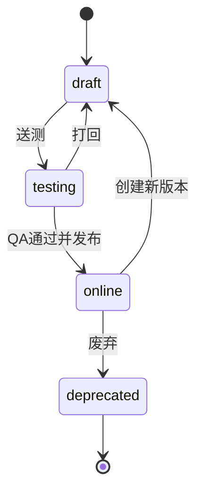

# 事件管理 PRD

> 所属模块：数据埋点 / 口径治理 / 事件管理
> 路由：`/data-tracking/events`  
> 优先级：P0  
> 状态：可直接用于 Vibecoding

## 1. 问题陈述

事件、属性和版本若只存在于文档或代码中，将发生重复命名、触发时机不精确、属性类型冲突、线上事件被直接改写、废弃事件仍持续上报、敏感属性被误加等问题。研发和 QA 也缺少明确的送测、验证和发布证据链。

## 2. 解决方案

建设事件治理工作台，使用“事件字典 / 属性字典 / 版本记录”三个 Tab，提供事件草稿、属性 Schema、引用关系、送测、QA 验证、发布、新版本和废弃的完整闭环。线上 Schema 不可原地破坏性修改，所有写操作有幂等、乐观锁和审计。

## 3. 用户故事

1. 作为埋点管理员，我想查看 110 个事件及状态，以统一事件事实。
2. 作为埋点管理员，我想按业务域、优先级、端和状态筛选事件。
3. 作为埋点管理员，我想创建事件草稿和属性定义。
4. 作为埋点管理员，我想引用公共属性，避免重复定义。
5. 作为埋点管理员，我想送测、发布和废弃事件。
6. 作为埋点管理员，我想创建新版本而不改写历史 Schema。
7. 作为 QA，我想查看发布检查项和联调验证证据。
8. 作为研发，我想查看精确触发时机和服务端/客户端责任。
9. 作为分析师，我想查看事件被哪些指标、分析和看板引用。
10. 作为安全人员，我想阻止 forbidden 属性进入事件。
11. 作为用户，我想在版本冲突时查看差异并保留草稿。
12. 作为用户，我想批量导出脱敏定义，但不能批量发布。

## 4. 页面结构

```text
FilterSection
├─ Tab：事件字典 / 属性字典 / 版本记录
├─ 搜索 / 业务域 / 优先级 / 状态 / 客户端 / Owner
└─ 查询 / 重置
DataSection
├─ 标题 / 新建事件 / 导出定义
├─ Table
└─ Pagination
GlobalLayer
├─ EventDetailDrawer
├─ EventEditorDrawer
├─ VersionDiffDrawer
└─ TransitionDialog
```

事件表列：选择、中文名、英文名、业务域、优先级、状态、客户端、当前版本、Owner、更新时间、操作。属性表列：key、中文名、类型、敏感等级、必填、引用事件数、状态、更新时间。版本表列：事件、版本、变更类型、提交人、审核人、状态、时间、操作。

## 5. 字段与校验

| 字段 | 规则 |
|---|---|
| 中文名 | 2–40 字，trim 后非空 |
| 英文名 | 2–80 位，`^[a-z][a-z0-9_]*$`，全局唯一 |
| 业务域 | 必选，使用埋点清单域枚举 |
| 描述 | 10–500 字，说明业务事实 |
| 触发时机 | 10–1000 字，必须包含对象状态和结果条件 |
| 客户端 | pc/web/server/admin，多选至少一项 |
| 优先级 | P0/P1/P2/P3 |
| Owner | 至少产品和研发各一名 |
| 保留期 | 30/90/180/365/730 天或合规配置 |
| 属性 key | 小写蛇形，全局属性不可被局部覆写 |
| 属性类型 | string/number/boolean/datetime/enum/array |
| 敏感等级 | public/internal/sensitive/forbidden |

forbidden 属性禁止引用；sensitive 属性必须有脱敏策略且不能提供原值示例。公共属性 event_id、event_time、user_id 等只读引用。

## 6. 事件编辑 Drawer

右侧宽 680px，标题和底部操作 sticky，内容独立滚动。区块：基础信息、触发与上报责任、属性列表、关联指标、发布检查。属性支持新增、引用、排序和移除；在线版本的既有属性只读。

保存草稿允许发布检查未完成，但基础字段必须合法。送测要求属性类型和枚举完整。发布 P0 事件还要求 Owner、触发规则、指标关联、QA 通过记录和敏感扫描通过。

## 7. 状态机与操作



| 状态 | 允许动作 |
|---|---|
| draft | 编辑、删除草稿、送测 |
| testing | 查看、QA 验证、打回、发布 |
| online | 查看、创建新版本、废弃 |
| deprecated | 查看历史、引用和数据截止时间 |

已上线事件不可删除、改名或修改既有属性类型。废弃前请求引用关系；有有效告警或看板引用时 Dialog 列出影响对象。确认废弃后历史仍可查询，新 event_time 晚于生效时间的生产事件被网关拒绝。

## 8. 交互与状态管理

1. 点击事件名打开详情 Drawer，不改变表格选择；
2. 新建/编辑创建 editor.draft；输入变更设置 dirty=true；
3. Drawer 关闭、切路由、切 Tab 时 dirty=true 弹“保存草稿/放弃/继续编辑”；
4. 保存中按钮 loading，使用 Idempotency-Key；成功更新 version 并刷新行；
5. 送测/发布/废弃使用 Dialog，提交成功刷新事件、分析选择器、质量和调试缓存；
6. 服务端 VERSION_CONFLICT 打开 Diff，显示本地草稿与最新版本；可复制本地草稿或刷新重做；
7. 批量选择仅支持导出定义、批量改 Owner；不支持批量发布/废弃；
8. 搜索 300ms 防抖；搜索词只查询事件中文/英文名，不记录原文埋点。

## 9. 加载中、空状态、错误 与极端边界

| 状态 | 表现 |
|---|---|
| 列表 Loading | 表格骨架 10 行，筛选可修改但查询按钮禁用 |
| 详情 Loading | Drawer 立即开，内部骨架；失败可局部重试 |
| 默认 Empty | “暂无埋点事件”，有权限展示新建 |
| 筛选 Empty | “未找到符合条件的事件”，展示清空筛选 |
| Error | 保留旧列表并标记 stale；禁止状态流转 |
| Forbidden | 无查看权限展示 403；无写权限隐藏主操作 |
| 长名称 | 单行省略，Tooltip 和复制提供完整值 |
| 属性 >100 | 分组虚拟列表，必填属性优先展开 |
| 引用 >50 | Drawer 分页并按类型筛选 |

## 10. 权限、安全与审计

权限：`schema.read/create/update/test/publish/deprecate/export`。前端可见性与服务端鉴权同时执行。事件和属性的创建、修改、状态流转、导出均写审计。导出只包含 Schema 定义，不包含明细排查或敏感示例。

## 11. 接口契约

| 场景 | 接口 |
|---|---|
| 事件列表/详情 | `GET /api/v1/tracking/events`、`GET /api/v1/tracking/events/{id}` |
| 创建/更新 | `POST /api/v1/tracking/events`、`PATCH /api/v1/tracking/events/{id}` |
| 状态流转 | `POST /api/v1/tracking/events/{id}/transitions` |
| 属性字典 | `GET /api/v1/tracking/properties` |
| 引用关系 | `GET /api/v1/tracking/events/{id}/references` |
| 版本/Diff | `GET /api/v1/tracking/events/{id}/versions`、`GET /api/v1/tracking/events/{id}/versions/diff` |

写接口携带 version 和 idempotencyKey；错误包括 DUPLICATE_EVENT_NAME、SCHEMA_INCOMPATIBLE、VERSION_CONFLICT、SENSITIVE_DATA_DETECTED、MISSING_QA_EVIDENCE。

## 12. 正式文案

- 保存成功：“草稿已保存”
- 送测成功：“已提交测试”
- 发布成功：“事件已发布”
- 废弃成功：“事件已废弃，历史数据仍可查询”
- 冲突：“数据已被他人修改，请查看差异后继续”
- 敏感命中：“检测到禁止采集的字段，请移除”

## 13. 模拟数据与门户标注

至少 12 个事件，覆盖 AUTH/ENV/PROXY/PAY/TEAM、P0–P3 和四种状态；18 个属性；8 条版本记录；3 个冲突样本；2 个敏感扫描失败样本。不得 Mock 敏感原值。

标注覆盖 Tab、筛选、新建、导出、事件名、状态、版本、属性引用、保存、送测、发布、废弃、Diff 和未保存确认；Drawer/Dialog 必须压栈标注作用域。

## 14. 测试决策

以 `eventsPageState + editorState` 测试外部行为，Schema 兼容性使用纯函数。验收：

1. 四状态只出现允许动作；
2. P0 发布检查准确；
3. online 不可原地改写；
4. 冲突不覆盖且草稿可恢复；
5. 重复提交只产生一次结果；
6. 废弃引用影响展示完整；
7. forbidden 属性无法保存；
8. 权限、审计和导出边界正确。
9. 新建/编辑表单的必填标识位于字段名左侧，统一使用 danger 色 `#D9001B`；标签与控件通过 `for/id` 关联，必填控件声明 `required`。

## 15. 非目标范围

直接修改业务代码、自动生成 SDK、基于未脱敏原始数据的自由分析、批量发布/废弃和删除线上历史。

## 16. 页面布局详细规格（V1.1 补充）

```text
Main / PageContainer（24px）
├─ FilterSection
│  ├─ TabBar：事件字典 / 属性字典 / 版本记录
│  ├─ FilterGrid：4 列 × 2 行
│  └─ 查询 / 重置
└─ DataSection
   ├─ Header（48px）：结果统计 | 新建事件 / 导出定义
   ├─ SelectionBar（有勾选时出现）
   ├─ DataTable（表头 sticky）
   └─ Pagination（56px）
GlobalLayer
├─ EventDetailDrawer（720px）
├─ EventEditorDrawer（760px）
├─ VersionDiffDialog（960px）
└─ TransitionDialog（520px）
```

| 区域 | 详细规则 |
|---|---|
| TabBar | 高 40px；切 Tab 保留搜索词，清除不兼容筛选和选择项 |
| 筛选区 | ≥1280px 4 列；1024–1279px 2 列；字段间距 16px |
| 表格 | 最小宽 1320px；表头 48px；行 52px；数据卡最小高 520px |
| 固定列 | 事件名在左、操作在右；操作列宽 144px |
| 分页 | 与表格同一卡片；总数左、页码及每页条数右 |

编辑 Drawer：Header 64px 固定；Body 独立滚动，依次为基础信息、触发与上报责任、属性列表、关联指标、发布检查；Footer 64px 固定，放置取消、保存草稿、送测/发布。属性表最小宽 640px；发布检查失败项可滚动并聚焦字段。

布局验收：Drawer 打开后锁定页面滚动并正确返回焦点；叠加 Diff Dialog 时 Portal 作用域成对 push/pop；批量操作条不遮挡表头；1024px 下 Drawer 最大宽为视口减 32px；Loading/Empty/Error/Forbidden 均保留 Tab 与数据卡外框。
