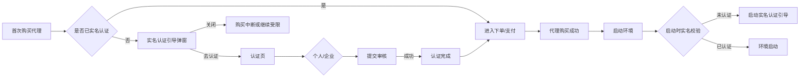

# 云登指纹浏览器数据埋点

> 文档版本：V1.0  
> 编制日期：2026-08-07  
> 适用范围：YunLogin PC 客户端、Web 端及服务端埋点实施  
> 文档定位：产品、研发、测试、数据分析及运营共同使用的埋点实施基线

## 1. 文档目标

本清单用于建立 YunLogin 从获客、注册、购买、实名认证、代理使用、浏览器环境创建与启动，到团队协作、自动化和续费留存的统一数据事实层，解决以下问题：

1. 用户在哪一步流失，原因是什么；
2. 哪些功能构成核心使用场景，哪些入口低效或冗余；
3. 代理购买、实名认证与浏览器启动之间的真实转化关系；
4. 指纹浏览器的激活、留存和商业价值由哪些行为驱动；
5. 产品迭代是否真正改善成功率、效率、稳定性和收入；
6. 各端能否按统一口径上报事件、计算指标、分析漏斗并监控数据异常。

本文不采集密码、Cookie 原文、2FA 密钥、代理密码、代理 API 提取链接、身份证号、营业执照内容、银行卡号等敏感信息。

## 2. 产品分析结论与埋点优先级

### 2.1 北极星指标

建议北极星指标为：**周成功运行环境数（Weekly Successfully Launched Environments，WSLE）**。

定义：自然周内至少成功启动一次且有效运行不少于 60 秒的去重浏览器环境数。该指标同时反映环境供给、代理可用性、配置正确性及用户真实业务使用，不应只用登录人数或环境创建数替代。

配套核心指标：

| 指标 | 业务意义 | 口径摘要 |
|---|---|---|
| 激活用户数 | 新用户是否到达核心价值 | 注册后 7 日内首次成功启动环境并运行 ≥60 秒的用户数 |
| 首次价值时间 TTFV | 新用户上手效率 | 注册成功至首次有效启动环境的时长中位数/P75 |
| 代理购买转化率 | 代理商业化效率 | 支付成功用户数 ÷ 进入代理购买页用户数 |
| 实名认证完成率 | 合规链路效率 | 认证成功用户数 ÷ 看到实名认证引导用户数 |
| 购后可用率 | 付费体验质量 | 购买代理后 24 小时内成功绑定并启动环境用户数 ÷ 代理购买成功用户数 |
| 环境启动成功率 | 核心可用性 | 启动成功次数 ÷ 启动请求次数；重复点击按 request_id 去重 |
| 代理检测成功率 | 网络资产质量 | 检测成功次数 ÷ 检测完成次数 |
| WAU/MAU | 使用黏性 | 发生有效核心行为的周/月去重用户数 |
| 4 周留存率 | 持续价值 | 首周激活用户在第 4 周再次有效启动的比例 |

### 2.2 优先级定义

| 优先级 | 重要程度 | 判断标准 | 上线要求 |
|---|---|---|---|
| P0 | 致命/核心 | 合规、收入、激活、核心成功率或故障定位必需 | 首期必须完整上线并设监控告警 |
| P1 | 高 | 决定功能采用、关键路径效率和留存 | 首期或紧随 P0 上线 |
| P2 | 中 | 支撑体验优化、入口布局、细分分析 | 第二阶段上线 |
| P3 | 低 | 局部交互或探索性分析 | 有明确分析计划时上线 |

### 2.3 埋点必要性评估

| 业务域 | 必要性 | 优先级 | 产品决策价值 |
|---|---|---:|---|
| 实名认证与合规拦截 | 极高 | P0 | 识别弹窗打扰、跳转流失、个人/企业审核效率及购后启动阻断 |
| 代理浏览、购买、绑定、检测 | 极高 | P0 | 衡量付费漏斗、供应质量、地区需求、失败原因和购后价值兑现 |
| 环境创建与启动 | 极高 | P0 | 定义激活与北极星指标，定位创建/启动失败和 TTFV |
| 登录、注册、会话 | 极高 | P0 | 识别获客转化、登录故障、版本与渠道质量 |
| 支付、订单、套餐、续费 | 极高 | P0 | 计算收入转化、客单价、复购和退款原因 |
| 环境编辑与指纹配置 | 高 | P1 | 发现高频配置、风险项、校验障碍及保存成功率 |
| 团队、成员、分享转移 | 高 | P1 | 衡量 B 端协作深度、权限障碍和扩席机会 |
| 插件、API、RPA | 高 | P1 | 判断进阶能力采用及留存贡献 |
| 导航、搜索、筛选、帮助 | 中 | P2 | 优化信息架构、默认入口和自助服务 |
| 局部展开、悬浮、复制 | 低至中 | P2/P3 | 仅在对应体验问题进入迭代时采集 |

## 3. 数据模型与命名规范

### 3.1 事件模型

采用“对象_动作_结果”英文小写蛇形命名，示例：`proxy_order_pay_success`。一个事件只表达一个事实；曝光、点击、请求、结果必须拆分。异步操作必须使用同一 `request_id` 串联。

标准事件结构：

```json
{
  "event_name": "identity_guide_cta_click",
  "event_time": "2026-08-07T17:30:00.000+08:00",
  "event_id": "uuid",
  "user_id": "内部匿名ID",
  "anonymous_id": "安装/浏览器匿名ID",
  "session_id": "会话ID",
  "team_id": "团队ID",
  "client": "pc|web|admin",
  "app_version": "4.0.2.4",
  "page_id": "proxy_purchase",
  "source_page": "proxy_market",
  "properties": {}
}
```

### 3.2 全局公共属性

所有事件默认携带以下属性；字段无值时传 `null`，不得传空字符串或自造枚举。

| 属性 | 类型 | 说明 |
|---|---|---|
| event_id | string | 客户端生成 UUID，用于幂等去重 |
| event_time / server_time | datetime | 客户端发生时间/服务端接收时间 |
| user_id / anonymous_id | string | 登录用户匿名 ID/登录前匿名 ID；登录后建立映射 |
| session_id | string | 一次前台活跃会话；30 分钟无操作可重置 |
| team_id / role | string | 团队及当前角色；不得上传团队名称 |
| client / os / os_version | enum/string | pc、web、admin；操作系统信息 |
| app_version / build_no | string | 客户端版本与构建号 |
| page_id / source_page / source_module | string | 当前页面、来源页与来源模块 |
| entry_point | enum | sidebar、banner、dialog、empty_state、deep_link、system_check 等 |
| network_type | enum | wifi、ethernet、cellular、unknown |
| experiment_ids | string[] | 命中的实验及版本 |
| trace_id / request_id | string | 跨端链路及单次请求关联标识 |
| event_schema_version | string | 事件结构版本 |

### 3.3 核心业务实体属性

仅传内部 ID、枚举或脱敏分类，不上传用户填写的敏感原文。

| 实体 | 允许属性 |
|---|---|
| 用户 | user_type、registration_age_days、is_new_user、member_level |
| 认证 | auth_type（personal/enterprise）、auth_status、review_channel、failure_code；禁止证件原文 |
| 代理 | proxy_id、proxy_source、proxy_type、country_code、region_code、provider_id、expire_bucket、availability_status；IP 仅允许掩码或不可逆哈希 |
| 订单 | order_id、product_type、sku_id、currency、amount、discount_amount、pay_channel、order_status |
| 环境 | environment_id、group_id、environment_count_bucket、kernel_version、simulated_os；禁止 Cookie/账号/启动网址原文 |
| 团队 | team_id、role、member_count_bucket、permission_code |

## 4. P0 专项：首次购买代理与实名认证

### 4.1 状态机及触发规则

“新用户首次购买代理”定义：`is_new_user=true` 且用户历史成功代理订单数为 0。购买动作若触发实名认证引导，弹窗曝光只记录一次；弹窗重复渲染不得重复上报。个人认证和企业认证均使用 `auth_type` 区分，不得拆成两套不可比较的事件名。



### 4.2 专项事件清单

| ID | 事件名 | 中文名称 | 精确触发时机 | 关键属性 | 优先级/重要程度 | 分析指标 |
|---|---|---|---|---|---|---|
| AUTH-001 | `identity_check_result` | 实名状态校验结果 | 首购提交前、购买成功后首次启动前完成服务端校验时 | check_scene（first_proxy_purchase/post_purchase_launch）、auth_status、auth_type、latency_ms、failure_code | P0/致命 | 校验成功率、未实名占比、耗时 |
| AUTH-002 | `identity_guide_popup_view` | 实名引导弹窗曝光 | 弹窗完整可见且前台停留 ≥500ms | trigger_scene、popup_version、auth_status、suggested_auth_type、first_proxy_purchase、order_id、environment_id | P0/致命 | 引导覆盖人数、场景分布 |
| AUTH-003 | `identity_guide_popup_close` | 关闭实名引导弹窗 | 点击关闭图标、取消按钮或 Esc；遮罩是否可关需单独枚举 | close_method、stay_duration_ms、trigger_scene、auth_type、next_state | P0/核心 | 关闭率、关闭方式、流失率 |
| AUTH-004 | `identity_guide_cta_click` | 点击去认证 | 点击“去认证”且按钮有效 | trigger_scene、selected_auth_type、popup_version | P0/核心 | 去认证点击率 |
| AUTH-005 | `identity_page_arrive` | 到达认证页 | 认证页路由与基础数据加载成功 | auth_type、source_scene、route_latency_ms、resume_order_id、resume_environment_id | P0/核心 | 跳转成功率、到达流失 |
| AUTH-006 | `identity_type_select` | 选择认证类型 | 选择或切换个人/企业认证 | auth_type、previous_auth_type、source_scene | P0/核心 | 个人/企业选择占比、切换率 |
| AUTH-007 | `identity_form_start` | 开始填写认证 | 首个非敏感字段首次发生有效输入或上传组件启动 | auth_type、source_scene | P0/核心 | 表单启动率 |
| AUTH-008 | `identity_material_upload_result` | 认证材料上传结果 | 单个材料上传完成 | auth_type、material_type、result、failure_code、file_size_bucket、duration_ms；禁止文件名和内容 | P0/核心 | 上传成功率、失败原因 |
| AUTH-009 | `identity_submit_click` | 提交认证 | 校验通过后点击提交；防重复点击 | auth_type、source_scene、field_error_count、request_id | P0/核心 | 提交率 |
| AUTH-010 | `identity_submit_result` | 认证提交结果 | 服务端返回提交结果 | auth_type、result、failure_code、review_mode、request_id | P0/致命 | 提交成功率、技术失败率 |
| AUTH-011 | `identity_review_result` | 认证审核结果 | 审核状态首次进入 approved/rejected | auth_type、review_result、failure_code、review_duration_sec、review_channel | P0/致命 | 认证完成率、驳回率、审核时长 |
| AUTH-012 | `identity_complete` | 实名认证完成 | 审核通过且账户实名状态持久化成功 | auth_type、source_scene、total_duration_sec、resume_target | P0/致命 | 认证完成人数、完成时长 |
| AUTH-013 | `identity_resume_result` | 认证后恢复原任务 | 认证完成后恢复购买或启动流程并得到结果 | auth_type、resume_target（purchase/launch）、result、failure_code | P0/核心 | 认证后任务恢复率 |
| AUTH-014 | `launch_identity_block_view` | 启动时实名拦截曝光 | 购买代理后启动环境，校验为未认证并展示引导 | auth_type、environment_id、proxy_id、order_id、launch_request_id | P0/致命 | 购后启动拦截人数/率 |
| AUTH-015 | `launch_identity_block_action` | 启动实名拦截操作 | 点击关闭、去认证、切换代理或取消启动 | action、auth_type、environment_id、launch_request_id | P0/核心 | 启动拦截去向、放弃率 |

### 4.3 必建漏斗与分群

1. 首购实名漏斗：购买页到达 → 首购提交 → 引导曝光 → 去认证 → 认证页到达 → 提交 → 审核通过 → 支付成功；
2. 购后启动漏斗：购买成功 → 绑定代理 → 点击启动 → 实名校验 → 认证完成 → 启动成功 → 有效运行；
3. 必须按 `auth_type=personal/enterprise`、新老用户、客户端版本、来源入口、失败码、代理品类和国家地区拆分；
4. 同时观测弹窗关闭用户 1 小时、24 小时、7 天内的认证回流率和购买完成率，避免只用即时点击率判断文案效果。

## 5. 全平台事件清单

### 5.1 注册、登录与会话

| ID | 事件名 | 触发时机 | 关键属性 | 优先级 | 指标/用途 |
|---|---|---|---|---|---|
| ACC-001 | `app_open` | 客户端冷启动完成 | launch_type、previous_version | P0 | DAU、版本覆盖、启动量 |
| ACC-002 | `app_bootstrap_result` | 会话、配置、权限加载完成/失败 | result、failure_code、duration_ms | P0 | 可进入率、启动性能 |
| ACC-003 | `register_page_view` | 注册页有效曝光 | source_channel、campaign_id | P0 | 注册入口流量 |
| ACC-004 | `verification_code_request_result` | 验证码请求返回 | scene、result、failure_code、country_code | P0 | 验证码成功率；禁止手机号 |
| ACC-005 | `register_submit_result` | 注册请求返回 | result、failure_code、agreement_checked、duration_ms | P0 | 注册转化率、失败原因 |
| ACC-006 | `login_submit_result` | 登录请求返回 | login_method、result、failure_code、duration_ms | P0 | 登录成功率 |
| ACC-007 | `session_expired` | 服务端确认会话过期 | active_page、unsaved_changes | P0 | 会话异常影响 |
| ACC-008 | `logout` | 用户主动退出或系统强退 | trigger_type、reason_code | P1 | 主动/异常退出 |

### 5.2 全局框架与导航

| ID | 事件名 | 触发时机 | 关键属性 | 优先级 | 指标/用途 |
|---|---|---|---|---|---|
| NAV-001 | `page_view` | 路由完成且页面可交互 | page_id、route_duration_ms、load_result | P0 | 页面访问和加载质量 |
| NAV-002 | `navigation_click` | 点击一级/二级菜单 | menu_id、menu_level、target_page、current_page | P1 | 模块采用、路径分析 |
| NAV-003 | `sidebar_toggle` | 展开/收起侧栏或菜单组 | target_id、result_state | P3 | 导航可用性 |
| NAV-004 | `global_create_browser_click` | 点击全局“新建浏览器” | source_page、unsaved_changes | P0 | 创建入口贡献 |
| NAV-005 | `notification_open` | 打开通知面板 | unread_count_bucket | P2 | 通知触达 |
| NAV-006 | `help_entry_click` | 点击教程、快捷键、客服 | help_type、source_page | P2 | 自助服务需求 |
| NAV-007 | `language_change` | 语言切换生效 | from_language、to_language | P2 | 多语言使用 |
| NAV-008 | `global_error_view` | 全局无权限、网络、路由失败态曝光 | error_type、failure_code、page_id | P0 | 系统级故障与权限障碍 |
| NAV-009 | `home_menu_view` | 正常菜单完整曝光 | menu_state（normal）、visible_item_count | P2 | 菜单布局有效性 |
| NAV-010 | `home_luidmenu_toggle` | 折叠菜单展开/收起切换 | toggle_direction（expand/collapse）、stay_duration_ms | P2 | 折叠菜单采用率 |
| NAV-011 | `home_usercenter_view` | 用户信息组件（UserInfo）曝光 | has_avatar、member_level_bucket | P2 | 用户中心触达 |
| NAV-012 | `home_usercenter_click` | 点击用户中心组件内操作项 | action_type（profile/logout/setting/team_switch）、target_page | P2 | 用户中心功能使用 |
| NAV-013 | `home_header_view` | 顶部 Header 组件完成渲染 | has_notification、has_update、client | P2 | 全局框架加载质量 |
| NAV-014 | `home_header_action_click` | 点击 Header 内功能入口 | action_type（notification/help/search/create/back） | P2 | 顶部入口流量分布 |

### 5.3 环境管理、创建与启动

| ID | 事件名 | 触发时机 | 关键属性 | 优先级 | 指标/用途 |
|---|---|---|---|---|---|
| ENV-001 | `environment_list_view` | 环境列表加载完成 | result_count_bucket、view_mode | P0 | 核心页活跃 |
| ENV-002 | `environment_search` | 搜索提交或防抖结果返回 | search_type、has_result、result_count_bucket；禁止关键词原文 | P1 | 查找效率 |
| ENV-003 | `environment_filter_apply` | 筛选条件生效 | filter_types、filter_count、result_count_bucket | P1 | 常用筛选、默认项优化 |
| ENV-004 | `environment_create_start` | 创建流程首屏可见 | entry_point、template_type | P0 | 创建漏斗起点 |
| ENV-005 | `environment_create_submit` | 校验通过并提交 | proxy_source、account_count_bucket、config_mode、request_id | P0 | 提交量、配置结构 |
| ENV-006 | `environment_create_result` | 创建接口返回 | result、failure_code、duration_ms、request_id | P0 | 创建成功率 |
| ENV-007 | `environment_launch_click` | 点击启动 | environment_id、proxy_source、auth_status、launch_request_id | P0 | 启动意图 |
| ENV-008 | `environment_precheck_result` | 启动前版本、权限、代理、实名检查结束 | result、failed_check、duration_ms、launch_request_id | P0 | 启动阻断定位 |
| ENV-009 | `environment_launch_result` | 浏览器进程启动成功或失败 | result、failure_code、duration_ms、launch_request_id | P0 | 启动成功率/耗时 |
| ENV-010 | `environment_effective_run` | 启动后持续运行 60 秒且未异常退出 | environment_id、launch_request_id、proxy_source | P0 | 激活、北极星指标 |
| ENV-011 | `environment_close` | 环境关闭完成 | close_type、run_duration_sec、exit_code | P0 | 使用时长、崩溃率 |
| ENV-012 | `environment_batch_action_result` | 批量启动/关闭/移动/删除完成 | action、selected_count_bucket、success_count、failure_count | P1 | 批量效率与失败率 |
| ENV-013 | `environment_delete_result` | 删除确认后返回 | result、failure_code、has_running_instance | P1 | 删除原因与安全性 |
| ENV-014 | `environment_restore_result` | 回收站恢复完成 | result、failure_code、retention_age_bucket | P1 | 误删恢复 |
| ENV-015 | `new_browser_page_view` | 新建浏览器中间页面可见 | entry_point、tab_type（single/batch/import/migration） | P0 | 创建流程入口分布 |
| ENV-016 | `new_browser_tab_switch` | 新建浏览器页切换单个添加/批量添加/导入/迁移 Tab | from_tab、to_tab | P1 | 创建方式偏好 |
| ENV-017 | `new_browser_proxy_category_view` | 切换代理分类 Tab（平台代理/本地网络/自有代理） | category_type（platform/local/self）、previous_category | P1 | 代理来源选择分布 |
| ENV-018 | `new_browser_view_platform_proxy` | 单个添加场景下查看平台代理列表 | page_id、default_filter_applied | P1 | 平台代理查看量 |
| ENV-019 | `new_browser_view_local_network` | 单个添加场景下查看本地网络选项 | has_available_local_network、local_network_count_bucket | P2 | 本地网络功能采用 |
| ENV-020 | `new_browser_view_self_proxy` | 单个添加场景下查看自有代理 Tab | self_proxy_count_bucket、has_api_proxy | P1 | 自有代理查看量 |
| ENV-021 | `new_browser_self_proxy_buy_click` | 自有代理 Tab 内点击"购买代理"入口 | entry_tab（self_proxy）、target_page（proxy_market） | P1 | 自有代理缺口转化 |
| ENV-022 | `new_browser_platform_proxy_detection_click` | 平台代理列表页点击"当前页代理检测" | page_size、proxy_selected_count_bucket、request_id | P1 | 平台代理页即时检测需求 |
| ENV-023 | `new_browser_platform_proxy_detection_result` | 当前页批量代理检测完成 | result、success_count、failure_count、average_latency_bucket、request_id | P0 | 平台代理供应质量 |
| ENV-024 | `new_browser_proxy_type_select` | 选择/切换代理类型（静态/动态/住宅/数据中心等） | proxy_type、previous_proxy_type、category_type | P1 | 代理类型偏好 |
| ENV-025 | `new_browser_proxy_area_select` | 选择/切换代理地区（国家/州/城市） | country_code、region_code、city_code、previous_area | P1 | 地区需求分布 |
| ENV-026 | `new_browser_proxy_bind_choice` | 选择是否绑定代理到环境 | bind_choice（yes/no）、bind_mode（immediate/later）、proxy_id | P1 | 代理绑定意愿 |
| ENV-027 | `new_browser_local_search` | 新建单个添加本地环境时执行搜索 | search_scope（local/single）、has_result、result_count_bucket；禁止关键词原文 | P2 | 本地环境查找效率 |
| ENV-028 | `new_browser_local_batch_add_start` | 点击进入本地浏览器批量添加流程 | entry_point、expected_count_bucket | P1 | 批量创建采用 |
| ENV-029 | `new_browser_local_batch_edit_start` | 进入本地浏览器批量编辑场景 | environment_count_bucket、source（list_multi_select/import_result） | P1 | 批量编辑采用 |
| ENV-030 | `new_browser_local_batch_submit` | 批量添加/批量编辑提交 | mode（add/edit）、environment_count_bucket、config_template_id、request_id | P0 | 批量提交量 |
| ENV-031 | `new_browser_local_batch_result` | 批量添加/批量编辑接口返回 | mode（add/edit）、result、failure_code、success_count、failure_count、duration_ms、request_id | P0 | 批量成功率、失败原因 |
| ENV-032 | `new_browser_self_proxy_add_confirm` | 单个添加-添加自有代理确认弹窗点击确定 | proxy_type、has_host、request_id | P1 | 自有代理添加确认量 |
| ENV-033 | `new_browser_self_proxy_add_result` | 添加自有代理返回 | proxy_type、result、failure_code、request_id | P0 | 自有代理添加成功率 |
| ENV-034 | `new_browser_env_group_auth_submit` | 环境管理-分组管理-环境授权点击确定 | group_id、environment_count_bucket、old_permission_code、new_permission_code、request_id | P1 | 分组环境授权频次 |
| ENV-035 | `new_browser_env_group_auth_result` | 分组环境授权接口返回 | result、failure_code、success_count、failure_count、request_id | P0 | 分组授权成功率 |
| ENV-036 | `env_group_batch_auth_click` | 分组管理点击"批量授权"入口 | group_id、unauth_count_bucket | P1 | 批量授权入口触发 |
| ENV-037 | `env_group_batch_auth_submit` | 分组管理-批量授权弹窗点击确定 | group_id、target_role_or_permission、environment_count_bucket、request_id | P1 | 批量授权确认量 |
| ENV-038 | `env_group_batch_auth_result` | 分组批量授权接口返回 | result、failure_code、success_count、failure_count、request_id | P0 | 批量授权成功率 |
| ENV-039 | `env_group_modify_submit` | 分组管理-修改分组点击确定 | group_id、changed_fields、request_id | P1 | 分组修改频次 |
| ENV-040 | `env_group_modify_result` | 分组修改接口返回 | result、failure_code、group_id、request_id | P0 | 分组修改成功率 |
| ENV-041 | `browser_import_start` | 点击进入批量导入 Tab 或上传组件就绪 | import_source（browser/chrome/edge/csv/manual）、entry_point | P1 | 导入功能采用 |
| ENV-042 | `browser_import_file_upload_result` | 导入文件上传结果 | file_type、file_size_bucket、result、failure_code | P1 | 导入文件质量与上传成功率 |
| ENV-043 | `browser_import_parse_result` | 导入解析/映射完成 | parse_count、valid_count、invalid_count、mapping_rules_applied、duration_ms | P0 | 导入数据质量 |
| ENV-044 | `browser_import_submit` | 导入确认提交 | import_source、import_count_bucket、request_id | P0 | 导入提交量 |
| ENV-045 | `browser_import_result` | 导入创建环境接口返回 | result、failure_code、success_count、failure_count、duplicate_count、duration_ms、request_id | P0 | 导入成功率、失败类型 |
| ENV-046 | `browser_migration_start` | 点击进入一键迁移 Tab 或选择源浏览器 | source_browser_type（chrome/edge/browser/other）、entry_point | P1 | 迁移功能采用 |
| ENV-047 | `browser_migration_scan_result` | 扫描源浏览器可迁移数据完成 | source_browser_type、env_count_bucket、account_count_bucket、plugin_count_bucket、scan_duration_ms | P1 | 可迁移资产规模 |
| ENV-048 | `browser_migration_submit` | 一键迁移确认提交 | source_browser_type、migrate_items（env/account/cookie/plugin）、request_id | P0 | 迁移提交量 |
| ENV-049 | `browser_migration_result` | 一键迁移接口返回 | result、failure_code、env_success_count、env_failure_count、account_success_count、account_failure_count、duration_ms、request_id | P0 | 迁移成功率与细分损失 |

### 5.4 环境编辑、账号与指纹

| ID | 事件名 | 触发时机 | 关键属性 | 优先级 | 指标/用途 |
|---|---|---|---|---|---|
| CFG-001 | `environment_edit_view` | 编辑页加载完成 | environment_id、load_duration_ms、permission_level | P1 | 编辑使用量 |
| CFG-002 | `config_section_toggle` | 展开/收起基础、指纹、插件、偏好 | section_id、state | P2 | 配置区关注度 |
| CFG-003 | `config_field_change` | 非敏感字段最终值发生变化 | section_id、field_id、value_category、is_risk_field；禁止原值 | P1 | 高频配置与风险项 |
| CFG-004 | `config_validation_error` | 字段或跨字段校验失败并展示 | section_id、field_id、error_code | P0 | 表单阻碍排序 |
| CFG-005 | `network_check_result` | 环境编辑内网络检测完成 | proxy_source、query_channel、result、failure_code、latency_bucket | P0 | 网络可用性 |
| CFG-006 | `account_mode_select` | 选择添加新账号/已有账号 | mode | P1 | 账号绑定方式 |
| CFG-007 | `account_bind_result` | 非敏感账号关联提交完成 | mode、platform_category、account_count_bucket、result、failure_code | P1 | 账号绑定成功率 |
| CFG-008 | `fingerprint_randomize` | 随机指纹执行完成 | trigger_source、overrode_manual_config、undo_available | P1 | 随机功能采用与覆盖风险 |
| CFG-009 | `fingerprint_randomize_undo` | 撤销随机指纹 | elapsed_ms | P1 | 误操作率 |
| CFG-010 | `fingerprint_consistency_result` | 一致性校验完成 | result、risk_count、risk_types | P0 | 风险配置占比 |
| CFG-011 | `environment_edit_save_result` | 保存接口返回 | result、failure_code、changed_section_count、changed_field_count、duration_ms | P0 | 保存成功率、失败原因 |
| CFG-012 | `unsaved_changes_dialog_action` | 离开保护弹窗操作 | action（stay/discard/save）、source_action | P1 | 草稿丢失风险 |

### 5.5 代理管理、市场与购买

| ID | 事件名 | 触发时机 | 关键属性 | 优先级 | 指标/用途 |
|---|---|---|---|---|---|
| PROXY-001 | `proxy_list_view` | 代理列表加载完成 | proxy_source、result_count_bucket | P0 | 代理管理活跃 |
| PROXY-002 | `proxy_filter_apply` | 类型、地区、绑定、过期等筛选生效 | filter_types、country_code、result_count_bucket | P1 | 地区/类型需求 |
| PROXY-003 | `proxy_search` | 搜索结果返回 | search_type、has_result；禁止关键词/IP 原文 | P1 | 查找效率 |
| PROXY-004 | `proxy_market_view` | 代理购买/商城页加载完成 | entry_point、default_country、default_proxy_type | P0 | 购买漏斗入口 |
| PROXY-005 | `proxy_product_view` | 商品详情有效曝光 | sku_id、provider_id、proxy_type、country_code、price_bucket | P0 | 商品兴趣 |
| PROXY-006 | `proxy_sku_select` | 规格、地区、时长、数量选择生效 | sku_id、country_code、duration_plan、quantity_bucket | P0 | 商品偏好 |
| PROXY-007 | `proxy_order_create_result` | 创建代理订单返回 | result、failure_code、order_id、sku_id、amount、currency | P0 | 下单成功率 |
| PROXY-008 | `proxy_order_pay_start` | 调起支付 | order_id、pay_channel、amount、is_first_proxy_order | P0 | 支付漏斗 |
| PROXY-009 | `proxy_order_pay_result` | 支付最终状态确定 | result、failure_code、order_id、pay_channel、duration_ms | P0 | 支付成功率、收入 |
| PROXY-010 | `proxy_purchase_success` | 支付成功且代理资产入账 | order_id、proxy_id、sku_id、country_code、is_first_proxy_order | P0 | 购买人数、GMV、首购 |
| PROXY-011 | `proxy_bind_result` | 代理绑定环境完成 | proxy_source、proxy_type、environment_id、result、failure_code | P0 | 绑定成功率、购后采用 |
| PROXY-012 | `proxy_auto_allocate_result` | 自动分配完成 | country_code、pool_id、result、failure_code、duration_ms | P0 | 自动分配成功率 |
| PROXY-013 | `proxy_test_result` | 单个或批量代理检测完成 | proxy_source、proxy_type、country_code、result、failure_code、latency_bucket | P0 | 供应质量、可用率 |
| PROXY-014 | `custom_proxy_add_result` | 自有代理保存返回 | proxy_type、result、failure_code | P1 | 自有代理采用；禁止凭证 |
| PROXY-015 | `proxy_api_add_result` | 代理 API 保存返回 | proxy_type、extract_method、result、failure_code | P1 | API 代理采用；禁止链接 |
| PROXY-016 | `proxy_renew_result` | 续费完成 | order_id、sku_id、result、failure_code、amount | P0 | 续费率与收入 |
| PROXY-017 | `proxy_refund_result` | 退款状态确定 | order_id、result、reason_code、amount | P0 | 退款率与原因 |

### 5.6 商城、费用、套餐与订单

| ID | 事件名 | 触发时机 | 关键属性 | 优先级 | 指标/用途 |
|---|---|---|---|---|---|
| PAY-001 | `store_page_view` | 商城页加载完成 | category、entry_point | P1 | 商城流量 |
| PAY-002 | `plan_compare_view` | 套餐对比区有效曝光 | current_plan、plans_shown | P1 | 套餐兴趣 |
| PAY-003 | `plan_select` | 选择套餐或席位 | sku_id、billing_cycle、seat_bucket | P0 | 套餐偏好 |
| PAY-004 | `checkout_submit_result` | 非代理商品下单返回 | product_type、sku_id、result、failure_code、amount | P0 | 下单转化 |
| PAY-005 | `payment_result` | 支付最终状态确定 | product_type、order_id、pay_channel、result、failure_code、amount | P0 | 收入与失败原因 |
| PAY-006 | `order_list_view` | 订单列表加载完成 | order_type、status_filter | P1 | 售后与财务访问 |
| PAY-007 | `invoice_apply_result` | 发票申请完成 | invoice_type、amount_bucket、result、failure_code | P1 | 开票需求 |
| PAY-008 | `balance_recharge_result` | 充值最终状态确定 | pay_channel、amount、result、failure_code | P0 | 充值收入 |

### 5.7 团队、成员、分享与日志

| ID | 事件名 | 触发时机 | 关键属性 | 优先级 | 指标/用途 |
|---|---|---|---|---|---|
| TEAM-001 | `team_switch_result` | 切换团队完成 | from_role、to_role、result、failure_code | P1 | 多团队使用 |
| TEAM-002 | `team_create_result` | 创建团队完成 | result、failure_code、source | P1 | B 端激活 |
| TEAM-003 | `member_invite_result` | 邀请发送返回 | invite_channel、role、result、failure_code | P1 | 邀请转化起点 |
| TEAM-004 | `member_invite_accept` | 受邀成员成功加入 | role、invite_age_bucket | P1 | 邀请接受率 |
| TEAM-005 | `member_permission_change_result` | 权限变更返回 | target_role_from、target_role_to、permission_scope、result | P0 | 权限配置与审计 |
| TEAM-006 | `resource_share_result` | 环境/代理/账号分享完成 | resource_type、target_type、resource_count_bucket、result | P1 | 协作深度 |
| TEAM-007 | `resource_transfer_result` | 资源转移完成 | resource_type、resource_count_bucket、result、failure_code | P0 | 资产流转成功率 |
| TEAM-008 | `audit_log_query` | 日志筛选结果返回 | action_category、operator_role、has_result | P2 | 审计需求 |
| TEAM-009 | `permission_denied_view` | 因权限不足展示禁用/提示 | page_id、action_id、permission_code | P0 | 权限阻碍排序 |

### 5.8 插件管理

| ID | 事件名 | 触发时机 | 关键属性 | 优先级 | 指标/用途 |
|---|---|---|---|---|---|
| PLG-001 | `plugin_list_view` | 插件列表加载完成 | installed_count_bucket | P1 | 插件管理活跃 |
| PLG-002 | `plugin_install_result` | 安装完成 | plugin_id、version、source、result、failure_code | P1 | 安装成功率 |
| PLG-003 | `plugin_toggle_result` | 启用/停用完成 | plugin_id、action、scope、result、failure_code | P1 | 插件采用 |
| PLG-004 | `plugin_group_save_result` | 插件组保存完成 | plugin_count_bucket、result、failure_code | P1 | 团队配置效率 |
| PLG-005 | `plugin_compatibility_block` | 因内核/权限/冲突被阻止 | plugin_id、block_reason、kernel_version | P1 | 兼容性优化 |

### 5.9 自动化 API 与 RPA

| ID | 事件名 | 触发时机 | 关键属性 | 优先级 | 指标/用途 |
|---|---|---|---|---|---|
| AUT-001 | `api_page_view` | API 页面加载完成 | role、has_key | P1 | API 兴趣 |
| AUT-002 | `api_key_action_result` | 创建、轮换、撤销密钥完成 | action、result、failure_code；禁止密钥 | P0 | 密钥安全与采用 |
| AUT-003 | `api_doc_click` | 打开接口文档 | doc_section、source_page | P2 | 文档需求 |
| AUT-004 | `api_request_summary` | 服务端按分钟聚合请求 | endpoint_group、status_class、latency_bucket、call_count | P1 | API 使用与质量 |
| AUT-005 | `rpa_task_create_result` | RPA 任务创建完成 | template_id、trigger_type、result、failure_code | P1 | RPA 创建率 |
| AUT-006 | `rpa_task_run_result` | 一次任务运行结束 | task_id、result、failure_code、duration_bucket | P0 | 自动化成功率 |
| AUT-007 | `rpa_task_toggle_result` | 启停任务完成 | action、result、failure_code | P1 | 活跃任务数 |

### 5.10 通知、帮助、设置与智能助手

| ID | 事件名 | 触发时机 | 关键属性 | 优先级 | 指标/用途 |
|---|---|---|---|---|---|
| SUP-001 | `notification_click` | 点击一条通知 | notification_type、target_page、age_bucket | P2 | 通知转化 |
| SUP-002 | `tutorial_step_complete` | 教程步骤完成 | tutorial_id、step_id、duration_ms | P2 | 新手引导完成率 |
| SUP-003 | `support_contact_click` | 发起客服联系 | source_page、issue_category | P2 | 问题集中区 |
| SUP-004 | `preference_save_result` | 偏好设置保存完成 | changed_fields、result、failure_code | P2 | 偏好采用 |
| SUP-005 | `assistant_open` | 智能助手抽屉打开 | source_page、entry_point | P2 | 助手使用率 |
| SUP-006 | `assistant_question_submit` | 问题提交 | intent_category、question_length_bucket；禁止问题原文默认入分析库 | P2 | 高频意图 |
| SUP-007 | `assistant_answer_feedback` | 点赞/点踩或解决确认 | intent_category、feedback、resolved | P2 | 回答质量 |

## 6. 指标口径与分析框架

### 6.1 关键漏斗

| 漏斗 | 步骤 | 决策用途 |
|---|---|---|
| 新用户激活 | 注册成功 → 首次进入环境页 → 创建环境 → 绑定/选择代理 → 创建成功 → 启动成功 → 有效运行 | 优化 TTFV、新手引导和默认配置 |
| 代理首购 | 购买页 → 商品详情 → 规格选择 → 实名引导 → 认证完成 → 创建订单 → 支付成功 → 资产入账 | 优化首购与合规转化 |
| 购后价值 | 购买成功 → 绑定环境 → 检测成功 → 启动 → 有效运行 → 7 日再次运行 | 判断供应质量和付费价值兑现 |
| 环境编辑 | 编辑页 → 修改配置 → 校验 → 保存 → 启动成功 | 判断配置项价值和风险 |
| 团队协作 | 创建团队 → 邀请 → 接受 → 分配权限 → 分享资源 → 成员有效启动 | 衡量团队激活与扩席机会 |
| 自动化采用 | API/RPA 页 → 创建密钥/任务 → 首次成功调用/运行 → 7 日重复使用 | 判断进阶能力价值 |

漏斗默认按用户去重，同时提供事件次数口径。步骤最大间隔需配置：即时交互默认 30 分钟，首购/认证默认 7 天，新用户激活默认 7 天。

### 6.2 留存与分群

- 激活留存：以首次 `environment_effective_run` 为第 0 日；
- 功能留存：代理购买用户、团队协作用户、API/RPA 用户分别建 cohort；
- 版本分群：对比升级前后启动成功率、崩溃率和关键漏斗；
- 价值分群：单环境用户、多环境用户、团队管理员、自动化重度用户；
- 供给分群：按代理服务商、类型、国家、到期区间比较检测及启动质量；
- 实名分群：个人/企业、即时通过/人工审核、首购触发/启动触发。

### 6.3 产品决策原则

1. 功能是否保留不能只看点击量，要同时看采用率、任务成功率、留存提升和收入贡献；
2. 高频不等于重要：启动、检测、保存等低频失败可能造成更高损失；
3. 弹窗优化同时看即时点击率与后续任务完成率，避免诱导点击；
4. 代理质量用“检测成功 + 启动成功 + 有效运行 + 退款”联合评估；
5. 指纹配置改版需监测一致性风险率、校验失败率、保存率及启动成功率；
6. 所有结论至少控制新老用户、版本、端、角色和流量来源，避免辛普森悖论。

## 7. 数据质量、验收与监控

### 7.1 上报机制

- 业务结果优先由服务端上报；客户端负责曝光、点击、表单和页面性能；
- 关键 P0 事件采用本地队列、失败重试和幂等 `event_id`；
- 支付、认证审核、代理入账以服务端最终状态为准，不以客户端成功页曝光代替；
- 离线事件恢复网络后补发，携带原 `event_time` 与 `server_time`；
- 同一事件不得客户端、服务端同时计数，确需双端验证时用不同事件并以 `trace_id` 对账。

### 7.2 验收标准

| 项目 | P0 标准 | P1-P3 标准 |
|---|---:|---:|
| 事件到达率 | ≥99.5% | ≥98% |
| 必填属性完整率 | ≥99.5% | ≥98% |
| 重复率 | <0.1% | <0.5% |
| 实时数据延迟 P95 | <5 分钟 | <30 分钟 |
| 枚举非法率 | 0 | <0.1% |
| 客户端与服务端关键结果差异 | <0.5% | <2% |

每个事件测试至少覆盖：正常路径、失败路径、取消、重复点击、弱网/离线、会话过期、无权限、页面刷新、版本升级及跨端一致性。

### 7.3 告警建议

- 登录、注册、认证提交、支付、代理入账、环境创建/启动成功率较 7 日同时间基线下降 ≥5 个百分点；
- P0 事件 10 分钟无数据或流量突增/骤降 ≥50%；
- 新客户端版本关键事件必填属性缺失率 >1%；
- 某代理服务商检测成功率或购后启动率连续 30 分钟低于阈值；
- 认证审核时长 P95、支付回调时长或启动耗时显著恶化。

## 8. 隐私与安全红线

禁止采集或传输：登录密码、短信验证码、身份证/护照号码及照片、真实姓名、企业证照内容、银行卡号、Cookie 原文、2FA 密钥、账号密码、代理用户名/密码、代理 API 提取链接、完整 IP、完整 UA 自定义原文、用户输入的网址和备注原文。

必要的技术识别应使用内部 ID、分桶、枚举、掩码或带业务隔离盐的不可逆哈希。任何新增属性必须完成用途说明、最小化审查、保留期限和权限评估后方可上线。

## 9. 分阶段落地计划

### 第一阶段：核心事实闭环（P0）

完成账号注册登录、首次购买代理、个人/企业实名认证、支付与入账、代理检测/绑定、环境创建/启动/有效运行、技术失败码、数据质量监控。目标是可靠回答“用户能否完成购买并成功使用”。

### 第二阶段：产品行为与留存（P1）

完成环境编辑、指纹一致性、团队协作、插件、API/RPA、续费退款及 cohort 分析。目标是回答“哪些能力驱动留存与收入”。

### 第三阶段：体验精细化（P2/P3）

完成导航、帮助、通知、局部交互与实验平台联动。每个低优事件上线前必须绑定明确的分析问题和决策负责人，避免只采不用。

## 10. 上线前最终检查清单

- [ ] 首购、购后启动两个实名认证场景均有校验、曝光、关闭、去认证、到达、提交、审核完成和任务恢复事件；
- [ ] 所有认证事件均可用 `auth_type` 区分个人与企业；
- [ ] 支付成功以服务端回调为准，代理购买成功以资产入账为准；
- [ ] 启动成功与有效运行分开定义；
- [ ] 客户端/服务端事件通过 request_id、trace_id 可关联；
- [ ] 事件与属性定义已完成评审并冻结 Schema 版本；
- [ ] 敏感字段自动扫描与人工审查均通过；
- [ ] P0 指标口径、漏斗计算和质量监控已完成验证；
- [ ] QA 已用调试模式逐条验证触发次数、时机、属性及去重；
- [ ] 产品、研发、测试、数据、安全共同签字后发布。

## 11. 技术旧埋点清单整合与实施冻结（V1.1 增补）

> 增补日期：2026-08-10
>
> 来源：技术旧清单中的 14 个 `page_id` 与 16 个 `element_id`
>
> 变更原则：本节仅追加，不改写第 1～10 章；旧清单尚未上线，原 `element_id` 只用于需求追溯，不作为生产上报字段。

### 11.1 最优方案与适用优先级

对旧清单的三种处理方式评估如下：

| 方案 | 优点 | 主要问题 | 结论 |
|---|---|---|---|
| 沿用旧 `element_id` | 研发理解成本低 | 混用驼峰与下划线，事件与 UI 层级强耦合，`sure/ok` 语义不明确，缺少结果事件 | 不采用 |
| 按本地/云环境分别建事件 | 路由归属直观 | 同一行为重复建设，后续分析需反复合并，页面改版会破坏口径 | 不采用 |
| 统一事件名并用属性区分场景 | 口径稳定，可横向比较本地/云环境，支持请求与结果对账 | 需要一次性冻结属性枚举 | **采用** |

实施时遵循以下优先级：

1. 第 1～10 章的数据模型、隐私、安全和质量要求继续有效；
2. 本节是截图所涉页面与事件的生产实施口径，规范事件名、触发时机和属性以本节为准；
3. 原 `element_id` 不上报，仅在 11.4 的映射表中保留；
4. 同一业务事实不得同时上报旧事件和规范事件，也不得因本地/云环境拆成两个事件名；
5. `page_id` 使用稳定业务语义，真实前端路由另存为 `route_path`，避免路由调整导致历史数据断层。

### 11.2 页面与组件字典

`newBrowser_singleAdd_*` 统一归属 `page_id=environment_create_single`，通过 `environment_mode=local|cloud` 区分本地浏览器与云环境。环境管理真实路由按确认结果使用 `/account`。

| 旧标识 | 类型 | 规范字段 | 规范值 | 路由/补充属性 | 实施说明 |
|---|---|---|---|---|---|
| `home_menu` | 组件 | source_module | `sidebar_navigation` | menu_state=`normal` | 不作为 page_id；菜单点击使用 `navigation_click` |
| `home_foldMenu` | 组件 | source_module | `sidebar_navigation` | menu_state=`collapsed` | 不作为 page_id；展开/收起使用 `sidebar_toggle` |
| `home_userCenter` | 组件 | source_module | `user_center` | component_name=`UserInfo` | 不采集常驻组件曝光，仅采集有明确业务结果的操作 |
| `home_header` | 组件 | source_module | `top_header` | - | 不采集常驻 Header 曝光；通知、帮助、创建等复用既有命令事件 |
| `/accoun` | 页面 | page_id | `environment_management` | route_path=`/account` | 旧清单拼写纠正为 `/account` |
| `/newBrowser` | 页面 | page_id | `environment_create_entry` | route_path=`/newBrowser` | 新建浏览器方式选择页 |
| `/newBrowser/local_single` | 页面 | page_id | `environment_create_single` | environment_mode=`local` | 与云环境单个添加共用 page_id |
| `/newBrowser/local_batch` | 页面 | page_id | `environment_create_batch` | environment_mode=`local` | 批量添加 |
| `/newBrowser/local_edit` | 页面 | page_id | `environment_edit` | environment_mode=`local` | 环境编辑 |
| `/newBrowser/yun_single` | 页面 | page_id | `environment_create_single` | environment_mode=`cloud` | 与本地单个添加共用 page_id |
| `/newBrowser/yun_batch` | 页面 | page_id | `environment_create_batch` | environment_mode=`cloud` | 批量添加 |
| `/newBrowser/yun_edit` | 页面 | page_id | `environment_edit` | environment_mode=`cloud` | 环境编辑 |
| `/newBrowser/batchImport` | 页面 | page_id | `environment_batch_import` | create_mode=`import` | 批量导入 |
| `/newBrowser/migration` | 页面 | page_id | `environment_migration` | create_mode=`migration` | 一键迁移 |

所有页面进入统一上报既有 `page_view`；不得为每条路由再创建一个独立的 `*_page_view` 事件。`page_view` 必须同时携带 `page_id`、`route_path`，创建/编辑页还须携带 `environment_mode` 和 `create_mode`。

### 11.3 最小充分实施事件清单

下表包含截图行为所需的完整事实链。标注“复用”的事件沿用第 5 章事件名并补充本节属性；标注“新增”的事件是旧清单缺少但完成漏斗或请求/结果对账所必需的事件。

| 实施 ID | 事件名 | 状态 | 精确触发时机 | 关键属性 | 上报端 | 优先级/用途 |
|---|---|---|---|---|---|---|
| SPEC-001 | `page_view` | 复用 NAV-001 | 路由完成、基础数据加载结束且页面可交互 | page_id、route_path、load_result、route_duration_ms、environment_mode、create_mode | 客户端 | P0/页面到达与加载质量 |
| SPEC-002 | `environment_create_start` | 复用 ENV-004 | 单个或批量创建首屏首次完整可见 | entry_point、environment_mode、create_mode、template_type | 客户端 | P0/创建漏斗起点 |
| SPEC-003 | `proxy_source_tab_view` | 新增 | 平台代理、本地网络或自有代理 Tab 内容完整可见 ≥500ms；同一次 Tab 激活只记一次 | proxy_source、previous_proxy_source、environment_mode、tab_activation_id | 客户端 | P1/代理来源选择分布 |
| SPEC-004 | `proxy_market_entry_click` | 新增 | 平台代理 Tab 内点击“购买代理”且入口可用 | source_module、proxy_source（platform）、environment_mode、target_page | 客户端 | P0/创建场景到代理购买的转化 |
| SPEC-005 | `proxy_test_submit` | 新增 | 点击“当前页代理检测”，前端校验通过且检测请求被接受 | detection_scope（current_page）、proxy_count_bucket、request_id | 客户端 | P1/检测意图与重复提交诊断 |
| SPEC-006 | `proxy_test_result` | 复用 PROXY-013 | 当前页代理检测进入最终状态 | proxy_source、proxy_type、country_code、result、success_count、failure_count、failure_code、latency_bucket、duration_ms、request_id | 服务端 | P0/供应质量与检测成功率 |
| SPEC-007 | `proxy_filter_apply` | 复用 PROXY-002 | 代理类型或地区筛选值实际变化并刷新结果 | filter_types、proxy_type、country_code、region_code、result_count_bucket | 客户端 | P1/代理类型与地区需求 |
| SPEC-008 | `proxy_bind_option_select` | 新增 | “是否绑定”值实际发生变化 | bind_choice（yes/no）、proxy_source、selected_proxy_count_bucket | 客户端 | P1/绑定意愿与创建流失 |
| SPEC-009 | `proxy_search` | 复用 PROXY-003 | 搜索防抖结束并返回结果；不得上报关键词、IP 或备注原文 | search_type、has_result、result_count_bucket、proxy_source | 客户端 | P1/代理查找效率 |
| SPEC-010 | `proxy_select_submit` | 新增 | 点击代理选择“确定”，校验通过且提交请求被接受 | proxy_source、selected_proxy_count_bucket、bind_choice、request_id | 客户端 | P0/代理选择漏斗提交量 |
| SPEC-011 | `proxy_bind_result` | 复用 PROXY-011 | 代理选择/绑定请求进入最终状态 | proxy_source、proxy_type、environment_id、result、failure_code、duration_ms、request_id | 服务端 | P0/绑定成功率与失败原因 |
| SPEC-012 | `custom_proxy_add_submit` | 新增 | 自有代理表单校验通过并点击添加 | proxy_type、authentication_required、request_id | 客户端 | P1/自有代理添加意图 |
| SPEC-013 | `custom_proxy_add_result` | 复用 PROXY-014 | 自有代理保存请求进入最终状态 | proxy_type、result、failure_code、duration_ms、request_id | 服务端 | P1/自有代理添加成功率 |
| SPEC-014 | `member_environment_authorization_start` | 新增 | 打开环境分组的成员授权面板并完成基础数据加载 | operation_mode（single/batch）、group_id、member_count_bucket、environment_count_bucket、dialog_id | 客户端 | P1/成员授权入口采用 |
| SPEC-015 | `member_environment_authorization_submit` | 新增 | 选择成员及权限后点击确定，校验通过且请求被接受 | operation_mode、group_id、member_count_bucket、environment_count_bucket、permission_scope、target_permission_code、request_id | 客户端 | P0/成员授权提交量 |
| SPEC-016 | `member_environment_authorization_result` | 新增 | 成员授权请求进入成功、部分成功或失败的最终状态 | operation_mode、group_id、result、success_count、failure_count、failure_code、duration_ms、request_id | 服务端 | P0/授权成功率与失败原因 |
| SPEC-017 | `environment_group_edit_start` | 新增 | 打开修改分组面板并完成原数据加载 | group_id、entry_point、dialog_id | 客户端 | P2/分组编辑采用 |
| SPEC-018 | `environment_group_update_submit` | 新增 | 分组信息实际变化、校验通过并点击确定 | group_id、changed_fields、request_id | 客户端 | P1/有效修改提交量 |
| SPEC-019 | `environment_group_update_result` | 新增 | 修改分组请求进入最终状态 | group_id、result、failure_code、duration_ms、request_id | 服务端 | P1/修改成功率与失败原因 |

### 11.4 旧 `element_id` 到规范事件映射

| 旧 element_id（仅追溯） | 规范事件名 | 固定/补充属性 | 处理说明 |
|---|---|---|---|
| `newBrowser_singleAdd_viewPlatformProxy` | `proxy_source_tab_view` | proxy_source=`platform` | 三个代理 Tab 合并为一个事件 |
| `newBrowser_singleAdd_viewLocalNetwork` | `proxy_source_tab_view` | proxy_source=`local_network` | 三个代理 Tab 合并为一个事件 |
| `newBrowser_singleAdd_viewSelfProxy` | `proxy_source_tab_view` | proxy_source=`self` | 三个代理 Tab 合并为一个事件 |
| `newBrowser_singleAdd_viewPlatformProxy_buyProxy` | `proxy_market_entry_click` | proxy_source=`platform` | 点击后用 `proxy_market_view` 验证是否到达商城 |
| `newBrowser_singleAdd_viewPlatformProxy_currentPageProxyDetection` | `proxy_test_submit` | detection_scope=`current_page` | 必须通过 request_id 关联 `proxy_test_result` |
| `newBrowser_singleAdd_viewPlatformProxy_selectProxyType` | `proxy_filter_apply` | filter_types包含 `proxy_type` | 不单独创建类型选择事件 |
| `newBrowser_singleAdd_viewPlatformProxy_selectProxyArea` | `proxy_filter_apply` | filter_types包含 `area` | 不单独创建地区选择事件 |
| `newBrowser_singleAdd_viewPlatformProxy_selectWhetherBind` | `proxy_bind_option_select` | - | 仅值实际变化时上报 |
| `newBrowser_singleAdd_viewPlatformProxy_search` | `proxy_search` | proxy_source=`platform` | 禁止上传搜索原文 |
| `newBrowser_singleAdd_viewPlatformProxy_sure` | `proxy_select_submit` | - | 用明确的 submit 语义替代 `sure` |
| `newBrowser_singleAdd_viewSelfProxy_addSelfProxy` | `custom_proxy_add_submit` | proxy_source=`self` | 必须补齐服务端 `custom_proxy_add_result` |
| `env_groupManage_auth_ok` | `member_environment_authorization_submit` | operation_mode=`single` | 授权对象为成员；必须补齐结果事件 |
| `env_groupManage_batchAuth` | `member_environment_authorization_start` | operation_mode=`batch` | 表达打开批量授权流程，不代表授权成功 |
| `env_groupManage_batchAuth_ok` | `member_environment_authorization_submit` | operation_mode=`batch` | 必须补齐服务端结果事件 |
| `env_groupManage_modify` | `environment_group_edit_start` | - | 表达打开编辑流程 |
| `env_groupManage_modify_ok` | `environment_group_update_submit` | - | 必须补齐服务端结果事件 |

### 11.5 本节属性字典

| 属性 | 类型 | 允许值/规则 | 数据要求 |
|---|---|---|---|
| route_path | string | 实际前端路由，如 `/account` | 不作为长期分析主键 |
| environment_mode | enum | local、cloud | 本节所有发生在创建/编辑页的事件必填 |
| create_mode | enum | single、batch、edit、import、migration | 本节所有创建/编辑相关事件必填 |
| proxy_source | enum | platform、local_network、self | 代理相关事件必填 |
| tab_activation_id | string | 单次 Tab 激活生成的临时 ID | 用于过滤重复渲染曝光 |
| detection_scope | enum | current_page、selected、all_filtered | 检测提交/结果必填 |
| operation_mode | enum | single、batch | 成员授权事件必填 |
| member_count_bucket | enum | 1、2-5、6-20、21-50、51+ | 不上传成员姓名或联系方式 |
| environment_count_bucket | enum | 1、2-5、6-20、21-50、51+ | 批量场景必填 |
| permission_scope | enum | 使用权限服务冻结字典 | 不允许自由文本 |
| target_permission_code | string | 权限服务内部代码 | 不上传角色/成员展示名称 |
| result | enum | success、partial_success、failure | 仅最终结果事件使用 |
| changed_fields | string[] | 产品和研发共同冻结的字段 ID 白名单 | 禁止上传修改前后原文 |
| request_id | string | 一次提交/请求唯一 ID | 提交与结果事件必须一致 |
| dialog_id | string | 一次弹窗实例唯一 ID | 用于过滤重复渲染 |

### 11.6 触发、去重与合并规则

1. `page_view` 仅在路由完成且页面可交互时上报；组件重新渲染不得重复上报；
2. `proxy_source_tab_view` 以 `tab_activation_id + proxy_source` 去重，默认选中的 Tab 也应记录一次；
3. 选择/筛选事件仅在最终值实际变化时上报，相同值重复点击不产生事件；
4. `proxy_search` 在防抖后的结果返回时上报，不记录每次键盘输入，不上传查询原文；
5. 所有 submit 事件在前端校验通过且请求真正发出时上报，按钮连点必须复用同一 `request_id`；
6. 所有 result 事件由服务端在最终状态上报，每个 `request_id` 只允许一个最终结果；部分成功使用 `partial_success` 并同时上报成功/失败数量；
7. 客户端弹窗曝光以 `dialog_id` 去重，重复渲染、前后台切换不得生成新的 start 事件；
8. 不实施 `home_menu_view`、`home_usercenter_view`、`home_header_view` 等常驻组件曝光；这些事件流量高但不能支持明确产品决策；
9. 折叠菜单只使用既有 `sidebar_toggle`，不新增或上报拼写不规范的 `home_luidmenu_toggle`；
10. Header、UserInfo 内的通知、帮助、创建、退出、团队切换等操作优先复用已有业务事件，并通过 `source_module` 标记入口；
11. 不并行上报语义相同的 `new_browser_*` 候选事件；生产事件名以 11.3 为唯一实施口径；
12. 代理地址、端口、用户名、密码、搜索词、成员姓名及分组名称均不得进入分析事件。

### 11.7 必建漏斗与验收

| 漏斗 | 步骤 | 关键分群 | 核心判断 |
|---|---|---|---|
| 单个环境代理选择 | `page_view` → `environment_create_start` → `proxy_source_tab_view` → `proxy_select_submit` → `proxy_bind_result` → `environment_create_submit` → `environment_create_result` | environment_mode、proxy_source、版本、失败码 | 代理选择是否阻碍环境创建 |
| 创建场景代理购买 | `proxy_market_entry_click` → `proxy_market_view` → `proxy_product_view` → `proxy_order_pay_result` → `proxy_purchase_success` → `proxy_bind_result` | environment_mode、代理类型、国家、首购用户 | 从创建缺口到购后可用的转化 |
| 当前页代理检测 | `proxy_test_submit` → `proxy_test_result` | proxy_type、country_code、provider_id、失败码 | 检测成功率、耗时与供应质量 |
| 成员授权 | `member_environment_authorization_start` → `member_environment_authorization_submit` → `member_environment_authorization_result` | operation_mode、权限代码、成员/环境数量分桶 | 单个与批量授权效率及失败原因 |
| 分组修改 | `environment_group_edit_start` → `environment_group_update_submit` → `environment_group_update_result` | entry_point、changed_fields、失败码 | 有效修改率与失败原因 |

上线验收必须满足：

- 14 个旧页面标识均已按 11.2 转换，页面字典与事件字典独立维护；
- 16 个旧 `element_id` 均可在 11.4 找到唯一规范映射，生产数据中旧 ID 数量为 0；
- 本地与云环境共用事件名，可通过 `environment_mode` 无损拆分；
- 每个 submit 均能通过 `request_id` 找到唯一 result，重复最终结果率小于 0.1%；
- 成员授权能区分 single/batch，且不含成员姓名、联系方式等展示信息；
- `/account` 页面上报 `page_id=environment_management`、`route_path=/account`；
- 搜索、代理凭证、成员信息和分组名称的敏感原文扫描结果为 0；
- QA 覆盖默认 Tab、重复切换、空结果、检测部分成功、绑定失败、授权部分成功、取消与重复点击。
