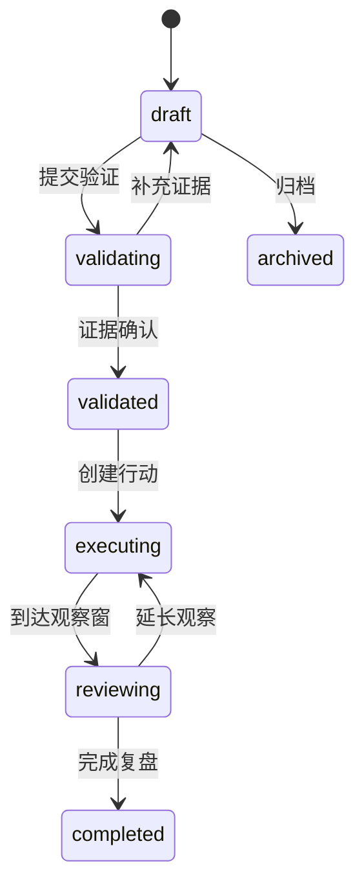

# 决策复盘 PRD

> 所属模块：数据埋点 / 决策复盘
> 路由：`/data-tracking/insights`  
> 需求类型：新增  
> 优先级：P1  
> 目标端：Web PC（设计基准 ≥1280px，最低支持 1024px）  
> 状态：可直接用于 Vibecoding  
> 更新日期：2026-08-11

## 0. 文档依据与执行约束

本模块承接数据分析的分析快照，不自动宣称因果关系，不复制用户明细。实现前读取《数据埋点产品规划.md》《数据埋点产品架构.md》《指标管理PRD.md》《数据分析PRD.md》和公共 PRD。

## 1. 问题陈述

分析结果散落在临时报表和沟通中，难以回答“发现了什么、证据是什么、决定做什么、谁负责、上线后是否改善”。同一问题反复分析，产品改动也常因缺少基线和观察窗而无法判断效果。

## 2. 解决方案

建立洞察列表、洞察详情、行动项和复盘四段闭环。洞察绑定不可变分析快照与证据等级；行动绑定版本/实验、Owner、目标指标和观察窗；到期生成复盘任务，记录达成状态与后续决策。

## 3. 用户故事

1. 产品经理可从分析结果创建洞察并保留口径证据；
2. 数据分析师可标记证据等级、适用分群和限制；
3. 负责人可将洞察转为行动并设置基线、目标和观察窗；
4. 管理者可查看洞察→行动→发布→复盘状态；
5. 审计人员可追踪证据、结论和状态变更；
6. 用户可区分已核实事实、合理推测、主观判断和证据不足。

## 4. 页面整体布局与模块结构

### 4.1 列表页

```text
AppShell
└─ Main
   ├─ FilterSection
   │  ├─ 搜索 / 业务场景 / 状态 / 证据等级
   │  ├─ Owner / 关联版本 / 复盘日期
   │  └─ 查询 / 重置
   └─ DataSection
      ├─ Header：洞察数量 / 新建洞察
      ├─ ViewSwitch：表格 / 看板
      ├─ InsightTable or StatusBoard
      └─ Pagination
GlobalLayer
├─ InsightDetailDrawer（760px）
├─ InsightEditorDrawer（760px）
├─ ActionEditorDialog（720px）
├─ ReviewDialog（820px）
└─ EvidenceSnapshotDrawer（880px）
```

### 4.2 详情 Drawer

```text
Header：标题 / 状态 / 证据等级 / 更多
Body（独立滚动）
├─ 结论摘要与事实边界
├─ 证据卡：分析快照 / 指标版本 / 分群 / 时间范围
├─ 限制与替代解释
├─ 行动项：Owner / 版本 / 目标 / 截止
├─ 效果追踪：基线 / 当前 / 目标 / 观察窗
└─ 时间线：创建 / 评审 / 决策 / 发布 / 复盘
Footer：编辑 / 转为行动 / 提交评审 / 复盘
```

### 4.3 布局规则

| 区域 | 布局 | 滚动/固定 |
|---|---|---|
| 筛选区 | 标签右对齐、控件左对齐且桌面宽 400px；单行最多 4 项；查询/重置紧跟最后条件并整体换行 | 页面滚动 |
| Tab 与数据列表 | Tab 下方保留 16px 间距 | 列表/看板切换时保持 |
| 表格 | 最小宽 1240px，行高 56px | 1024–1279 横向滚动 |
| 状态看板 | 4 列：待验证/已验证/执行中/待复盘 | 列内纵向滚动，不横向拖拽 |
| 详情 Drawer | 760px，卡片纵向排列 | 标题/底部固定，正文滚动 |
| 证据 Drawer | 880px，图表+数据表 | 内部滚动，只读 |

## 5. 领域对象与字段

| 对象 | 核心字段 |
|---|---|
| Insight | insight_id、标题、业务场景、结论、事实边界、状态、证据等级、Owner |
| Evidence | snapshot_id、analysis_id、metric_version、分群、时间范围、样本量、限制 |
| Action | action_id、方案、负责人、关联版本/实验、截止时间、状态 |
| Outcome | 基线、目标、当前值、观察窗、结果、复盘结论 |

证据等级：observed（描述性事实）、correlated（相关关系）、experiment_supported（实验支持）、expert_judgement（专家判断）、insufficient（证据不足）。只有 experiment_supported 可使用“实验表明”，correlated 必须使用“相关”。

## 6. 核心流程



1. 从数据分析“创建洞察”自动带入只读分析快照；
2. 创建者补充结论、限制、替代解释和证据等级；
3. 评审人确认口径与事实边界；
4. 转为行动时必须填写 Owner、目标指标版本、基线、目标值、关联发布和观察窗；
5. 观察窗结束生成复盘任务；
6. 复盘选择达成、部分达成、未达成、证据不足，并记录后续动作。

## 7. 预置业务场景

- 新用户激活与 TTFV；
- 订阅/套餐转化卡点；
- 代理购买、入账、绑定和实际使用；
- 个人/企业实名认证与原任务恢复；
- 环境创建、启动、有效运行与留存；
- 高频功能、核心场景、低效/冗余入口；
- 版本发布对成功率、效率、稳定性和收入的影响。

## 8. 交互、状态与边界

- 分析快照不可修改；原分析被删除后快照仍可读；
- 状态流转需权限并写审计；
- 洞察标题 4–80 字，结论 20–1000 字，限制至少一项；
- 无证据快照只能保存 draft，不可进入 validated；
- 一个行动只能绑定一个主目标指标，可附最多 5 个护栏指标；
- 目标指标版本在行动创建后冻结，复盘不追随最新版本；
- 查询失败保留旧列表并标记 stale；stale 状态禁止评审和复盘；
- Empty-default 提供“从数据分析创建”，避免无证据手工结论；
- 看板视图按状态分列，卡片移动前弹出状态要求，不支持自由越级拖动。

## 9. 权限、安全与审计

权限：`insight.read/create/update/validate/action/review/archive`。证据快照遵循原分析的数据范围；失去明细权限后仍可查看聚合快照，不可打开明细。创建、编辑、评审、行动、复盘和导出均审计。

## 10. 接口契约

| 场景 | 接口 |
|---|---|
| 列表/详情 | `GET /api/v1/tracking/insights`、`GET /api/v1/tracking/insights/{id}` |
| 创建/更新 | `POST /api/v1/tracking/insights`、`PATCH /api/v1/tracking/insights/{id}` |
| 证据快照 | `POST /api/v1/tracking/insights/{id}/evidence` |
| 状态流转 | `POST /api/v1/tracking/insights/{id}/transitions` |
| 行动项 | `POST /api/v1/tracking/insights/{id}/actions` |
| 复盘 | `POST /api/v1/tracking/insights/{id}/reviews` |

## 11. 正式文案

- “洞察草稿已保存”
- “该结论为相关关系，不能直接解释为因果关系”
- “请先关联分析快照并说明证据限制”
- “行动已创建，将在观察窗结束后提醒复盘”
- “复盘已完成，指标口径保持为行动创建时版本”

## 12. 模拟数据、标注与验收

Mock 至少 16 条洞察、20 个行动、8 个复盘，覆盖五种证据等级、六种状态、指标改善/恶化/无变化/证据不足和失去权限。

验收：

1. 分析快照可创建洞察且保持不可变；
2. 证据不足不能进入已验证；
3. 相关性与实验支持使用不同正式文案；
4. 行动冻结目标指标版本并可到期复盘；
5. 洞察、行动、发布和效果形成完整时间线；
6. 表格/看板/Drawer 在三种目标宽度下可用；
7. 数据权限、审计、状态越级和 stale 限制正确。

## 13. 非目标范围

AI 自动生成结论、自动执行产品改动、因果推断平台、项目管理系统替代品和用户级画像。
