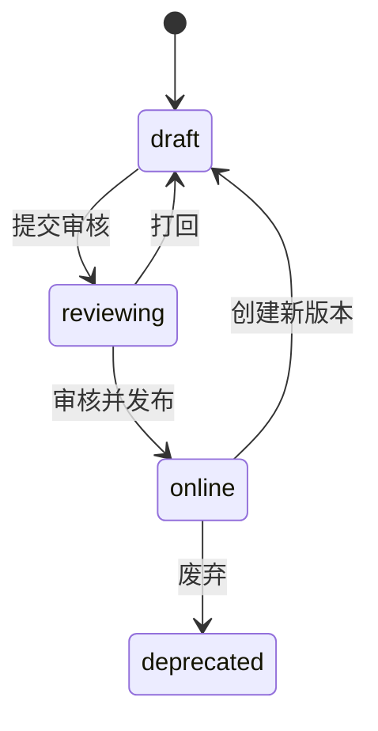

# 指标管理 PRD

> 所属模块：数据埋点 / 口径治理 / 指标管理
> 路由：`/data-tracking/metrics`  
> 需求类型：新增  
> 优先级：P0  
> 目标端：Web PC（设计基准 ≥1280px，最低支持 1024px）  
> 状态：可直接用于 Vibecoding  
> 更新日期：2026-08-11

## 0. 文档依据与执行约束

实现前读取《数据埋点产品规划.md》《数据埋点产品架构.md》《数据埋点PRD.md》《云登指纹浏览器数据埋点.md》和 Vibe Coding 产品 PRD 模版。指标管理是全后台指标口径的唯一发布入口；原型只使用脱敏 Mock，不执行真实计算。

## 1. 问题陈述

指标若分散在数据概览、数据分析和资产沉淀中各自计算，会出现同名不同义、分子分母不一致、历史口径被静默改写、无法追溯事件版本、质量异常仍被展示等问题。

## 2. 解决方案

提供指标字典、指标编辑、版本差异、血缘影响、试算校验、送审发布和废弃闭环。线上指标只读，修改必须创建新版本；所有消费模块仅引用已发布 metric_id + version。

## 3. 用户与成功指标

| 角色 | 任务 |
|---|---|
| 数据分析师 | 定义、试算和维护指标 |
| 产品经理 | 阅读口径、申请变更、查看影响 |
| 数据负责人 | 审核并发布指标 |
| 研发 | 实现计算和核对数据源 |
| 审计人员 | 查看变更、访问和发布证据 |

V1 目标：核心指标发布覆盖率 100%；重复口径为 0；线上指标破坏性改写为 0；指标到事件血缘覆盖率 100%；关键指标对账差异 <0.5%。

## 4. 页面整体布局与模块结构

### 4.1 页面骨架

```text
AppShell
├─ TopBar（56px，固定）
├─ Sidebar（220px/64px，固定）
└─ Main（唯一纵向滚动容器）
   ├─ FilterSection
   │  ├─ Tab：指标字典 / 维度字典 / 版本记录
   │  ├─ 搜索 / 业务域 / 状态 / Owner / 更新日期
   │  └─ 查询 / 重置
   └─ DataSection
      ├─ Header：结果数 / 新建指标 / 导出定义
      ├─ MetricTable
      └─ Pagination
GlobalLayer
├─ MetricDetailDrawer（720px）
├─ MetricEditorDrawer（760px）
├─ LineageDrawer（720px）
├─ VersionDiffDialog（960px）
└─ TransitionDialog（520px）
```

### 4.2 区域布局

| 区域 | 布局与尺寸 | 滚动/固定 | 关键交互 |
|---|---|---|---|
| 筛选区 | 4 列栅格，字段间距 16px | 页面滚动 | 搜索 300ms 防抖；查询显式触发 |
| 数据标题 | 高 48px，标题左、主操作右 | 卡片内 sticky | 权限不足隐藏写操作 |
| 指标表 | 最小宽 1280px，表头 48px、行 52px | 1024–1279 横向滚动 | 名称打开详情，状态/版本可筛选 |
| 编辑 Drawer | 760px，基础信息/计算口径/维度/血缘/发布检查 | 标题和底部固定，正文滚动 | 未保存离开确认 |
| 血缘 Drawer | 来源在左、指标居中、消费端在右 | 内容滚动 | 点击节点打开对象详情 |

≥1440px 展示全部表列；1280–1439px 收纳次要操作；1024–1279px 侧栏折叠、筛选 2 列、表格横向滚动；<1024px 显示不支持编辑提示。

## 5. 指标表与字段定义

表列：选择、指标中文名、metric_key、业务域、主体、统计周期、状态、当前版本、Owner、引用数、更新时间、操作。

| 字段 | 规则 |
|---|---|
| 中文名 | 2–40 字，业务语义唯一 |
| metric_key | `^[a-z][a-z0-9_]{1,79}$`，全局唯一 |
| 主体 | user/environment/order/proxy/team/session |
| 聚合 | count/distinct_count/sum/avg/ratio/percentile |
| 分子/分母 | ratio 必填，引用已上线事件或指标 |
| 窗口 | realtime/day/week/month/rolling_N_days |
| 去重键 | 与主体一致；多键需说明原因 |
| 过滤 | 结构化条件，不接受自由 SQL |
| 时区 | 默认 Asia/Shanghai，可指定 UTC |
| 归因窗口 | 商业转化类必填 |
| 维度 | 仅引用已发布维度 |
| 数据源 | 事件、业务事实表、派生指标 |
| Owner | 产品和数据至少各一名 |

## 6. 指标编辑与试算

1. 编辑分为基础信息、计算口径、维度与分群、血缘、发布检查五段；
2. 试算必须选择时间范围和数据范围，最大 30 天，返回样本量、结果、质量状态和对账差异；
3. 试算结果仅用于验证，不自动发布；
4. 分母为 0 返回 null，前端显示“—”，不得显示 0%；
5. 未成熟留存周期标记 incomplete，不参与平均；
6. 线上指标变更创建新版本，旧版本继续供历史快照读取；
7. 删除仅限未被引用的 draft；online 只能废弃。

## 7. 状态机



发布检查：名称与 key 唯一、口径完整、来源在线、血缘无环、质量通过、试算成功、对账差异达标、Owner 完整、敏感扫描通过。

## 8. 交互、状态与边界

- 保存使用 Idempotency-Key；更新携带 version 乐观锁；
- VERSION_CONFLICT 打开差异 Dialog，保留本地草稿；
- 血缘存在循环时阻止保存并高亮路径；
- 来源事件废弃时指标标记 at_risk，但不删除历史；
- 查询失败保留旧表并标记 stale，禁止发布；
- Empty-default 提供“新建指标”，Empty-filtered 提供“清空筛选”；
- 超长公式使用结构化摘要和展开，不直接显示 SQL；
- 权限撤销立即关闭编辑 Drawer 并保留可下载草稿摘要。

## 9. 权限、安全与审计

权限：`metric.read/create/update/review/publish/deprecate/export`。创建、编辑、试算、审核、发布、废弃和导出均审计。禁止在指标条件中使用直接身份、Cookie、密码、证件或代理凭证。

## 10. 接口契约

| 场景 | 接口 |
|---|---|
| 列表/详情 | `GET /api/v1/tracking/metrics`、`GET /api/v1/tracking/metrics/{id}` |
| 创建/更新 | `POST /api/v1/tracking/metrics`、`PATCH /api/v1/tracking/metrics/{id}` |
| 试算 | `POST /api/v1/tracking/metrics/{id}/preview` |
| 血缘/影响 | `GET /api/v1/tracking/metrics/{id}/lineage` |
| 状态流转 | `POST /api/v1/tracking/metrics/{id}/transitions` |
| 版本差异 | `GET /api/v1/tracking/metrics/{id}/versions/diff` |

## 11. 正式文案

- “指标草稿已保存”
- “试算完成，结果仅用于口径验证”
- “检测到循环依赖，请调整指标引用”
- “指标已发布，历史版本保持不变”
- “该指标仍被使用，请先查看影响范围”

## 12. 模拟数据、标注与验收

Mock 至少 18 个指标、8 个维度、12 条版本记录，覆盖 draft/reviewing/online/deprecated、分母 0、未成熟周期、血缘循环、对账失败和版本冲突。

验收：

1. 指标可完成草稿、试算、审核、发布、废弃闭环；
2. online 不可原地改写，历史版本可复现；
3. 指标血缘覆盖事件、派生指标、数据概览、数据分析和资产沉淀；
4. ratio、留存、金额和百分位口径边界正确；
5. 循环依赖、质量失败和对账超差阻止发布；
6. 筛选标签右对齐、控件左对齐且桌面宽度 400px，单行最多 4 项，查询/重置紧跟最后一个筛选条件并随流式布局换行；三种目标宽度布局可用，Drawer 标题/底部固定；
7. 权限、审计、脱敏和并发冲突符合公共规则。

## 13. 非目标范围

自由 SQL、自动生成数仓任务、AI 自动定义指标、因果推断和直接修改业务数据库。
