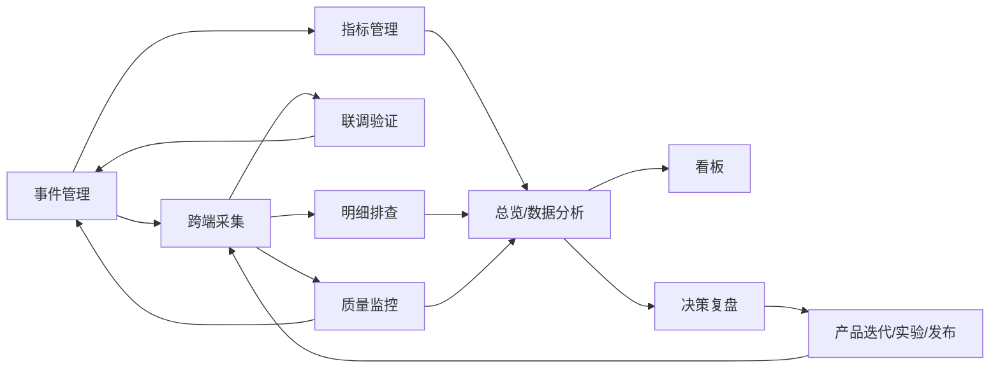

# 数据埋点 PRD

> 产品：云登后台管理系统 
> 模块：数据埋点 
> 需求类型：新建 
> 优先级：P0 
> 目标端：Web PC（设计基准 ≥1280px，最低支持 1024px） 
> 文档日期：2026-08-07 
> 状态：可直接用于 Vibecoding

## 0. 文档依据与 AI 执行指令

实现前按顺序完整读取：本 PRD → 九份模块 PRD →《云登指纹浏览器数据埋点.md》→ `design.md` → `claude.md` → `agent.md`。本 PRD 统一定义信息架构、领域模型、权限、公共状态和跨模块契约；模块 PRD 定义页面差异与业务闭环；埋点清单是事件、属性、指标、质量和隐私口径的单一事实来源。

生成高保真、可交互单文件原型 `数据埋点.html`，使用语义化 HTML5、Tailwind CSS CDN、Lucide、Chart.js 和原生 JavaScript ES6+。不使用 React、Vue、jQuery，不拆分本地 CSS/JS，不连接真实接口。全部数据由 JS Mock 驱动，控制台零错误。

必须复用云登后台 App Shell 和 

## 1. 问题陈述

云登已有覆盖注册、代理首购、个人/企业实名认证、环境创建与启动、团队协作、插件、API/RPA 等业务的 110 个埋点事件，但缺少可治理、可分析、可调试、可告警的后台产品。事件定义若散落在代码和表格中，会出现同名不同义、客户端点击冒充服务端结果、属性缺失、Schema 破坏性变更、敏感字段误采和指标无法复现。

产品、数据、研发、QA、运营和安全需要在统一后台中使用同一事件与指标口径，并在 Loading、Empty、Error、权限撤销、并发编辑、超大数据量和异步任务下获得明确反馈与恢复路径。

## 2. 解决方案

建立“数据埋点”后台模块，包含：

1. 数据概览：核心经营、激活、实名、代理、环境和数据质量概览；
2. 事件管理：事件/属性 Schema、版本、状态流转和引用治理；
3. 指标管理：指标口径、版本、血缘、试算和发布治理；
4. 联调验证：测试会话监听、Schema 校验和脱敏载荷检查；
5. 质量监控：质量规则、告警实例、确认与恢复；
6. 明细排查：历史脱敏事件查询、行为序列与受控异步导出；
7. 数据分析：事件、漏斗、留存、路径、用户分群和业务模板；
8. 资产沉淀：聚合分析卡片的组织、共享与布局；M6 验收前不进入可见导航；
9. 决策复盘：分析证据、产品行动、关联发布和效果复盘。

北极星指标沿用“周成功运行环境数（WSLE）”。支付、认证审核、代理入账和环境启动结果以服务端事实为准，不以客户端成功页或点击代替。

## 3. 用户、权限与成功指标

| 角色 | 核心任务 | 权限 |
|---|---|---|
| 超级管理员 | 配置全部模块权限和数据范围 | 全部，但不可查看禁采原文 |
| 产品经理 | 数据概览、数据分析、资产沉淀 | 聚合分析、看板编辑 |
| 数据分析师 | 指标管理、数据分析、分群、质量监控 | 分析全权限 |
| 埋点管理员 | 事件/属性创建、送测、发布、废弃 | Schema 管理 |
| 研发 | 调试上报、定位失败 | 调试与技术元数据 |
| QA | 验证触发次数、时机、属性和版本 | 联调验证、字典只读 |
| 运营 | 查看授权资产沉淀 | 聚合只读 |
| 安全审计 | 查看敏感扫描、变更和访问审计 | 审计只读 |

| 指标 | V1 目标 |
|---|---:|
| P0 事件到达率 | ≥99.5% |
| P0 必填属性完整率 | ≥99.5% |
| 重复率 | <0.1% |
| 实时数据延迟 P95 | <5 分钟 |
| 非法枚举率 | 0 |
| 关键结果对账差异 | <0.5% |
| 敏感字段误采 | 0 |

## 4. 用户故事

1. 作为产品经理，我想一屏查看核心指标，以快速判断产品健康度。
2. 作为产品经理，我想下钻新用户激活和代理首购漏斗，以定位流失步骤。
3. 作为产品经理，我想区分个人与企业认证，以优化不同实名路径。
4. 作为数据分析师，我想复用同一事件与属性字典，以保证分析口径一致。
5. 作为数据分析师，我想构建事件、漏斗、留存、路径和分群分析，以验证产品假设。
6. 作为埋点管理员，我想按草稿、测试、上线、废弃治理事件版本，以保护历史口径。
7. 作为研发，我想通过 request_id 和 trace_id 定位跨端链路，以排查上报问题。
8. 作为 QA，我想监听测试会话并标记验证结果，以形成发布证据。
9. 作为运营，我想查看授权看板而不接触用户明细，以满足最小权限。
10. 作为安全人员，我想阻止敏感值进入埋点和复制结果，以降低泄露风险。
11. 作为用户，我想在查询失败后保留筛选和旧结果，以便恢复工作。
12. 作为用户，我想明确区分默认无数据和筛选无结果，以采取正确行动。
13. 作为用户，我想在并发编辑时查看差异而非被静默覆盖。
14. 作为键盘用户，我想操作导航、表单、弹窗和图表数据表。
15. 作为授权分析人员，我想通过明细排查查询历史脱敏事件记录和会话行为序列，以定位聚合异常。
16. 作为授权分析人员，我想创建受审计的异步明细导出任务，以离线核对数据样本。

## 5. 信息架构与路由

```text
资源管理〔灰色静态分组标题〕
├─ 环境管理
└─ 代理列表
数据埋点〔灰色静态分组标题；不可点击、不可折叠〕
├─ 数据概览〔一级〕 /data-tracking/overview
├─ 口径治理〔一级，可展开，无业务路由〕
│ ├─ 事件管理〔二级〕 /data-tracking/events
│ └─ 指标管理〔二级〕 /data-tracking/metrics（M1 后显示）
├─ 联调验证〔一级〕 /data-tracking/debug
├─ 质量监控〔一级〕 /data-tracking/alerts
├─ 明细排查〔一级〕 /data-tracking/event-details
├─ 数据分析〔一级〕 /data-tracking/analysis
├─ 资产沉淀〔一级〕 /data-tracking/dashboards（M6 后显示）
└─ 决策复盘〔一级〕 /data-tracking/insights（M6 后显示）
```

“数据埋点”不是路由入口；用户必须点击具体一级菜单或口径治理的二级菜单进入页面。首次从其他业务区进入数据埋点能力时，产品快捷入口默认指向数据概览。功能菜单切换保留全局日期、团队、客户端、版本和时区；页面级筛选仅在返回原路由时保留。无目标权限时不显示该菜单，直达链接展示 403；口径治理无可见二级菜单时隐藏，全部阶段不可见时隐藏整个灰色标题。

## 6. 页面骨架与公共组件

顶部栏固定 56px；侧栏展开 220px、折叠 64px；主内容区是唯一页面滚动容器。页面严格采用“筛选区 + 数据区”两区块：筛选区使用 4 列栅格，数据区标题与主操作同行，表格与分页位于同一卡片。禁止独立页面标题卡片。

```text
AppShell
├─ TopBar：团队 / 日期 / 时区 / 刷新 / 用户
├─ Sidebar：静态分组标题 + 八阶段一级菜单 + 口径治理二级菜单
└─ RouterOutlet
 ├─ FilterSection
 ├─ DataSection
 └─ GlobalLayer：Drawer / Dialog / Toast / Annotation
```

公共组件：GlobalFilterBar、MetricCard、ChartCard、DataTable、Pagination、QueryStatusBar、EmptyState、ErrorState、PermissionState、SchemaBadge、EventPicker、PropertyFilterBuilder、AsyncTaskProgress、ConfirmDialog、DetailDrawer、Toast。

响应式：≥1440px 完整布局；1280–1439px 收纳次要操作；1024–1279px 侧栏默认折叠、筛选 2 列、表格横向滚动；<1024px 展示明确阻断页，不压缩成不可操作布局。

## 7. 公共状态与状态管理

```js
appState = {
 route: 'overview',
 permissions: [],
 globalFilters: {
 range: 'last_7_days',
 teamId: 'all',
 client: 'all',
 appVersion: 'all',
 timezone: 'Asia/Shanghai'
 },
 pageState: {},
 query: {
 status: 'idle',
 requestId: null,
 error: null,
 lastUpdatedAt: null,
 stale: false
 },
 selection: { ids: [], activeId: null },
 editor: {
 mode: null,
 draft: null,
 dirty: false,
 submitting: false,
 version: null
 },
 overlays: { drawer: null, modal: null, popover: null },
 toastQueue: []
}
```

这是原型与 E2E 的唯一高层测试接缝。规则：

1. 全局筛选变化取消旧请求、生成新 requestId 并刷新当前模块；
2. 只接受与当前 requestId 一致的响应，旧响应不得覆盖新结果；
3. 查询失败保留上次成功结果并标记 stale，显示可重试横幅；
4. 功能路由切换关闭 Popover；有未保存 Drawer 时先弹离开确认；
5. 写操作仅锁定冲突按钮，不整页遮罩；成功后刷新所有引用区域；
6. 权限被撤销时终止提交、关闭编辑浮层并进入 403；
7. 浮层开关必须同步 

## 8. 公共状态与边界

| 状态 | 规则 |
|---|---|
| Loading | 首屏结构骨架；局部查询保留旧结果；超过 10 秒进入 Error |
| Empty-default | 无筛选且 total=0，展示创建/配置 CTA |
| Empty-filtered | 有筛选且 total=0，展示清空筛选 |
| Error-page | 页面基础数据失败，提供重试和返回 |
| Error-local | 单图表/列表失败，仅替换目标区域 |
| Forbidden | 显示缺少权限码和申请权限/返回入口 |
| Stale | 查询失败时旧数据仍可读但不可执行写操作 |
| Extreme | 长名称省略+Tooltip；百分比分母 0 显示“—”；大数缩写但可查看完整值 |

日期 >90 天按周聚合，>730 天按月聚合；图表序列 >10 显示 Top 9 + 其他；分页 20/50/100；事件列表使用服务端分页；金额使用最小货币单位计算；未成熟留存周期不得按 0 参与平均。

## 9. 领域模型与跨模块契约

| 对象 | 唯一标识 | 核心关系 |
|---|---|---|
| TrackingEvent | eventDefinitionId | 拥有多个 SchemaVersion 和 PropertyDefinition 引用 |
| SchemaVersion | schemaVersionId | 属于一个事件，可被调试与质量结果引用 |
| PropertyDefinition | propertyDefinitionId | 被多个事件引用 |
| EventDetail | eventId | 已入库的脱敏事件事实，可关联 Schema、会话与质量结果 |
| EventDetailExport | exportTaskId | 绑定不可变查询快照、脱敏字段和文件生命周期 |
| MetricDefinition | metricId | 使用事件和属性定义口径 |
| AnalysisDefinition | analysisId | 可保存为 DashboardCard |
| Dashboard | dashboardId | 拥有布局和多张卡片 |
| DebugSession | debugSessionId | 产生 DebugEvent 与验证记录 |
| AlertRule | alertRuleId | 产生 AlertInstance |
| AuditRecord | auditId | 记录全部治理与权限操作 |

跨模块联动：

- 事件发布后刷新事件选择器、属性选择器、数据分析、调试校验和质量规则；
- 事件废弃前返回资产沉淀、数据分析模板和质量监控引用；确认后历史数据仍可查询；
- 分析结果可保存为看板卡片；卡片保存 query snapshot，不引用可变草稿；
- 联调验证结果是 P0 事件发布的前置证据；
- 质量监控可从数据概览、事件详情和联调验证深链进入并携带筛选。
- 数据概览、数据分析和质量监控可下钻明细排查；明细排查可跳转 Schema、联调验证和质量监控；资产沉淀仍禁止包含用户明细。

## 10. 公共业务规则

| ID | 规则 |
|---|---|
| G-01 | 事件英文名为 2–80 位小写蛇形且全局唯一 |
| G-02 | online 事件不可原地修改，必须创建新版本 |
| G-03 | 已上线属性类型不可破坏性变更 |
| G-04 | P0 发布需 Owner、触发规则、完整属性、QA 通过和关联指标 |
| G-05 | 支付、认证审核、代理入账、环境启动由服务端上报结果事实 |
| G-06 | 同一 event_id 幂等，所有写操作使用 Idempotency-Key |
| G-07 | 编辑对象使用 version 乐观锁，冲突必须展示差异 |
| G-08 | forbidden 属性不可被事件引用或显示原值 |
| G-09 | 个人/企业认证必须通过 auth_type 分群 |
| G-10 | 所有禁采字段遵循《云登指纹浏览器数据埋点.md》，模块权限不能放宽 |

## 11. 公共接口语义

响应统一包含 requestId、code、message、data、fieldErrors。错误码：

| 错误码 | UI 处理 |
|---|---|
| UNAUTHENTICATED | 刷新令牌一次，失败则登录并返回原路由 |
| FORBIDDEN | 关闭写浮层、刷新权限、展示 403 |
| VALIDATION_ERROR | 映射到字段并聚焦首错 |
| VERSION_CONFLICT | 打开差异 Dialog，保留本地草稿 |
| RATE_LIMITED | 按 retryAfter 倒计时 |
| QUERY_TIMEOUT | 保留查询配置与旧结果 |
| SENSITIVE_DATA_DETECTED | 阻止保存，显示命中规则但不显示原值 |
| INTERNAL_ERROR | 保留输入并允许幂等重试 |

异步分析返回 taskId，状态为 queued/processing/success/partial_fail/failed/cancelled/expired；进度只使用服务端 progress，不由前端估算。

## 12. 模块开发优先级

开发优先级按照“先定义事实 → 再验证上报 → 再保障质量 → 再消费数据 → 最后沉淀协作资产”的依赖链排列。这里的开发批次用于指导排期，不改变各模块 PRD 中对核心业务能力的 P0 重要性判断。

| 开发顺序 | 模块 | 开发批次 | 重要程度 | 排序依据 | 前置依赖 | 阶段完成标准 |
|---:|---|---|---|---|---|---|
| 0 | 公共基础能力 | P0-Foundation | 致命 | 九个目标业务路由共享路由、权限、选择器、异步任务、错误边界和审计；不先统一会导致重复建设 | App Shell、RBAC、公共接口响应 | 已开放路由可达；公共筛选和 `appState` 可用；Loading/Empty/Error/403 可复用 |
| 1 | 事件管理 | P0-1 | 致命 | 事件、属性、Schema、版本和状态是所有分析与质量能力的事实源 | 公共基础能力、《云登指纹浏览器数据埋点.md》 | 110 个事件可导入/查询；草稿→测试→上线→废弃闭环；P0 发布校验和版本冲突可验证 |
| 2 | 指标管理 | P0-2 | 致命 | 指标必须先统一口径、版本和血缘，消费端才不会各自计算 | 事件管理、指标计算与对账服务 | 核心指标可试算、审核、发布、追溯血缘和历史版本 |
| 3 | 联调验证 | P0-3 | 致命 | 事件定义后必须先证明各端真实上报正确，才能开放数据概览和数据分析 | 事件管理、调试流服务、脱敏服务 | 可按测试标识监听；Schema 校验、敏感扫描、QA 验证和 500 条容量边界通过 |
| 4 | 质量监控 | P0-4 | 致命 | 上报上线后需要持续发现缺失、重复、延迟、非法枚举和敏感误采 | 事件管理、联调验证、质量计算服务、通知渠道 | 七类质量规则可配置；告警触发、确认、静默、恢复和去重闭环通过 |
| 5 | 数据概览 | P1 | 核心 | 只有事件、指标和质量可信后，经营、实名、代理和环境指标才可展示 | 指标管理、质量结果 | KPI、趋势、实名/首购/购后漏斗可用；指标可下钻；每卡独立错误边界通过 |
| 6 | 明细排查 | P1 | 高 | 聚合异常需要历史脱敏样本完成定位；必须晚于脱敏、质量与权限底座 | 事件管理、脱敏服务、质量结果、审计、异步任务 | 详情与限定行为序列可查；导出限时限次并审计；禁采原值零暴露 |
| 7 | 数据分析 | P1 | 高 | 自助分析建立在稳定字典、可信事实和统一指标上 | 指标管理、异步查询、数据概览口径 | 五类分析与预置业务模板可运行、恢复、保存和创建洞察 |
| 8 | 资产沉淀 | M6 | 中 | 画布、查询快照、权限和并发冲突完成后才适合共享 | 数据分析、画布编辑器、权限、卡片查询服务 | 编辑、发布、共享、布局冲突和单卡容错通过 |
| 9 | 决策复盘 | M6 | 高 | 决策追踪依赖稳定分析快照、指标版本和发布信息 | 数据分析、指标管理、发布版本信息 | 洞察、行动、观察窗、复盘和审计形成闭环 |

### 12.1 推荐交付阶段

| 阶段 | 包含模块 | 可交付业务价值 | 准入下一阶段的质量门槛 |
|---|---|---|---|
| M0：公共底座 | 公共基础能力 | 形成统一路由、状态、权限、错误和审计契约 | 公共组件自动化测试通过；九个目标业务路由不再自建重复状态 |
| M1：埋点治理闭环 | 事件管理 + 指标管理 + 联调验证 | 能定义事件与指标并验证真实上报 | P0 必填属性完整率 ≥99.5%；核心指标可追溯；敏感误采为 0 |
| M2：质量保障闭环 | 质量监控 | 能主动发现、通知、确认和恢复数据异常 | 七类规则均完成故障演练；告警去重、静默、恢复无状态错误 |
| M3：核心数据消费 | 数据概览 | 管理层和产品可使用可信核心指标 | KPI 与业务服务对账差异 <0.5%；局部故障不阻塞整页 |
| M4：明细排查 | 明细排查 | 授权人员可用脱敏样本闭合异常定位 | 时间/租户/字段权限生效；详情、序列、导出和审计通过 |
| M5：自助分析 | 数据分析 | 产品和数据可自主验证假设 | 五类分析口径验收通过；大查询、取消、超时、恢复完整 |
| M6：决策沉淀 | 资产沉淀 + 决策复盘 | 将分析资产共享，并跟踪行动和效果 | 画布、权限、快照、并发、行动、观察窗和复盘全部通过后开放 |

### 12.2 并行开发规则

1. M0 完成前不得并行开发九套目标模块的独立状态和权限逻辑；
2. 事件管理的只读字典稳定后，联调验证前端可与事件管理写流程并行；
3. 质量监控可在调试校验码和质量指标契约冻结后并行开发，不等待全部事件录入；
4. 数据概览可提前制作静态骨架和 Mock，但真实指标联调必须等待事件口径与质量对账通过；
5. 明细排查可在脱敏、审计和质量状态契约冻结后并行开发，导出不得绕过异步任务底座；
6. 数据分析的查询任务框架可与数据概览并行，但五类分析口径须逐项评审后开放；
7. 资产沉淀保持导航隐藏；只有画布编辑、布局持久化、冲突处理和分析查询快照契约全部通过验收后方可开放。

### 12.3 优先级调整原则

- 发生合规或敏感数据风险时，联调验证的脱敏与质量监控优先于所有展示能力；
- P0 事件仍无法稳定上报时，暂停数据概览、数据分析和看板的真实数据联调；
- 若首期资源受限，最小可发布范围为 M0 + M1 + M2；数据概览可作为下一发布批次；
- 不得为了提前交付看板而复制或硬编码指标计算逻辑；
- 任一阶段未达到完成标准，只能灰度验证，不得标记为正式上线。

## 13. 模拟数据与原型要求

九个目标业务路由使用一套共享 Mock Store：至少 12 个事件、18 个属性、18 个指标、8 个版本、36 条脱敏事件记录、12 组趋势、7 个业务模板、8 张看板、16 条洞察、500 条可生成调试事件、8 条告警规则和 12 条告警实例。覆盖 P0–P3、draft/testing/online/deprecated、personal/enterprise、PC/Web/Server、正常/失败/超时/无权限。

“更多”菜单提供仅原型可见的状态模拟器：normal/loading/empty/error/forbidden/extreme。切换后即时更新当前模块且不刷新浏览器。

## 14. 测试决策

优先通过 `appState + render()` 这一处最高接缝测试外部行为。向状态容器注入路由、权限、接口结果和异常，断言用户可见状态、可用动作、数据流向和恢复路径；格式化、Schema 兼容性和漏斗口径使用纯函数测试。不测试具体 DOM 嵌套或内部变量名。

共同验收：

1. 所有已达到阶段门槛的路由可达且唯一高亮；未达门槛的模块不显示空白入口；
2. 全局筛选跨模块保留，页面筛选互不污染；
3. normal/loading/empty/error/forbidden/extreme 均可演示；
4. 写操作 loading、防重复、失败回滚、冲突和权限撤销完整；
5. 禁采值不出现在 Mock、DOM、Toast、URL、复制内容和控制台；
6. 1280/1440/1920 无意外横向溢出，1024 可操作；
7. 键盘可达、焦点回归、颜色非唯一信息；
8. 
9. 控制台零报错。

## 15. 非目标范围

真实 SDK、上报网关、消息队列、实时计算、数仓、自助 SQL、用户画像、真实身份搜索、禁采原文、无限行为轨迹、AI 结论生成、移动端完整编辑、从后台修改 YunLogin 业务流程，以及未经明确要求的 Git/部署。

## 16. 模块 PRD 索引

- 《数据概览PRD.md》
- 《事件管理PRD.md》
- 《明细排查PRD.md》
- 《数据分析PRD.md》
- 《资产沉淀PRD.md》
- 《联调验证PRD.md》
- 《质量监控PRD.md》
- 《指标管理PRD.md》（新增）
- 《决策复盘PRD.md》（新增）
- 《数据埋点产品规划.md》

## 17. V1.1 目标架构与页面布局更新

> 本节为 2026-08-11 规划更新。在目标模块、建设阶段和页面布局发生冲突时，以本节及对应模块 PRD 为准；“目标存在”不等于“当前导航已开放”。

### 17.1 八个一级模块与治理子模块

数据埋点目标态使用八个一级模块表达完整产品链路，名称同时作为菜单名、页面标题、模块 PRD 名和 HTML 文件名。口径治理无独立页面，仅包含事件管理、指标管理两个二级模块；公共数据底座作为跨模块能力，不计入导航模块数量。

1. 数据概览：核心健康、激活、实名、代理、环境和质量摘要；
2. 口径治理：统一管理事件与指标口径；二级模块为事件管理、指标管理；
3. 联调验证：测试会话、Schema 校验、敏感扫描和 QA 证据；
4. 质量监控：质量规则、实例、通知、确认、静默和恢复；
5. 明细排查：历史脱敏事件、有限行为序列和受控导出；
6. 数据分析：事件、漏斗、留存、路径、分群和预置业务模板；
7. 资产沉淀：聚合卡片组织、共享、订阅与布局；
8. 决策复盘：分析证据、行动、发布和效果复盘。

公共数据底座统一提供 RBAC、团队数据范围、筛选、脱敏、审计、异步任务和错误模型。

### 17.2 目标信息架构与导航状态

```text
数据埋点〔灰色静态分组标题，无路由〕
├─ 数据概览〔一级〕 /data-tracking/overview
├─ 口径治理〔一级，可展开〕
│ ├─ 事件管理〔二级〕 /data-tracking/events
│ └─ 指标管理〔二级〕 /data-tracking/metrics（M1 新增）
├─ 联调验证〔一级〕 /data-tracking/debug
├─ 质量监控〔一级〕 /data-tracking/alerts
├─ 明细排查〔一级〕 /data-tracking/event-details
├─ 数据分析〔一级〕 /data-tracking/analysis
├─ 资产沉淀〔一级〕 /data-tracking/dashboards（M6 开放）
└─ 决策复盘〔一级〕 /data-tracking/insights（M6 新增）
```

数据埋点位于资源管理分组之后，灰色标题不点击、不折叠、不进入 Tab 顺序，也不产生导航埋点。八个一级菜单对应产品链路；仅口径治理可展开事件管理和指标管理二级菜单。指标管理完成 M1 验收后显示；资产沉淀和决策复盘完成 M6 权限、并发、快照与复盘验收后显示。口径治理无可见子项时隐藏；完全无数据埋点权限时隐藏整个分组标题。

| 当前页面 | 一级菜单高亮 | 二级菜单高亮 | 面包屑 | 页面标题 |
|---|---|---|---|---|
| 数据概览 | 数据概览 | — | 数据埋点 / 数据概览 | 数据概览 |
| 事件管理 | 口径治理 | 事件管理 | 数据埋点 / 口径治理 / 事件管理 | 事件管理 |
| 指标管理 | 口径治理 | 指标管理 | 数据埋点 / 口径治理 / 指标管理 | 指标管理 |
| 联调验证 | 联调验证 | — | 数据埋点 / 联调验证 | 联调验证 |
| 质量监控 | 质量监控 | — | 数据埋点 / 质量监控 | 质量监控 |
| 明细排查 | 明细排查 | — | 数据埋点 / 明细排查 | 明细排查 |
| 数据分析 | 数据分析 | — | 数据埋点 / 数据分析 | 数据分析 |
| 资产沉淀 | 资产沉淀 | — | 数据埋点 / 资产沉淀 | 资产沉淀 |
| 决策复盘 | 决策复盘 | — | 数据埋点 / 决策复盘 | 决策复盘 |

口径治理点击只切换展开状态，不改变当前路由；进入事件管理或指标管理时父级必须展开并显示父级激活态，二级叶子显示唯一强高亮。侧栏收起为 64px 时，口径治理通过键盘可达的浮出菜单展示两个二级项，关闭后焦点返回一级菜单。

### 17.3 后台页面公共布局

```text
┌──────────────────────── TopBar 56px（固定） ────────────────────────┐
├─ Sidebar 220/64px ─┬─ Main：唯一页面滚动容器 ─────────────────────┤
│ │ PageContainer：max 1600px；padding 24px │
│ 数据埋点〔灰色〕 │ ┌─ FilterSection / WorkspaceToolbar ─────┐ │
│ 数据概览 │ └─────────────────────────────────────────┘ │
│ 口径治理 │ ┌─ QueryStatusBar（按需）─────────────────┐ │
│ 事件/指标管理 │ └─────────────────────────────────────────┘ │
│ 联调/质量/明细 │ ┌─ DataSection / AnalysisWorkspace ──────┐ │
│ 分析/资产/决策 │ │ 表格、图表、画布或双栏工作区 │ │
│ │ └─────────────────────────────────────────┘ │
└────────────────────┴──────────────────────────────────────────────┘
GlobalLayer：Popover < Drawer < Dialog < Toast；```

| 布局对象 | 统一规则 |
|---|---|
| TopBar | 高 56px，固定，不参与业务页面纵向滚动 |
| Sidebar | 展开 220px、折叠 64px；1024–1279px 默认折叠 |
| Main | 唯一页面级纵向滚动容器；禁止 body 与内部区域形成双重页面滚动 |
| PageContainer | 最大宽 1600px；常规 padding 24px；区块间距 24px |
| FilterSection | 4 列栅格；1024–1279px 2 列；字段间距 16px |
| DataSection | 标题、工具、内容、分页在同一卡片；表格表头 sticky |
| Drawer | 常用 680–760px；Header/Footer sticky，Body 独立滚动 |
| Dialog | 520–1040px；最大高 80vh；正文独立滚动 |
| 响应式 | ≥1440px 完整；1280–1439px 收纳次操作；1024–1279px 降列/横向表格；<1024px 阻断编辑 |

数据分析和联调验证属于工作台例外：可以使用左右双栏，但只能有一个页面主滚动容器，内部虚拟列表或检查器可独立滚动。看板画布使用 12 列栅格，不适用普通“筛选区 + 表格”结构。

### 17.4 跨模块业务闭环



跨模块契约新增：

- `MetricDefinition` 使用 `metricId + version` 唯一确定发布口径；
- `Insight` 必须绑定不可变 `analysisSnapshotId`；
- `Action` 冻结目标指标版本、基线、目标值、Owner、发布版本与观察窗；
- 数据分析“创建洞察”不得传递用户明细，只传聚合快照和事实边界；
- 数据概览、资产沉淀和决策复盘统一显示指标版本与数据质量状态；
- 质量不可信时可以查看历史结果，但禁止发布指标、评审洞察或完成复盘。

### 17.5 更新后的交付阶段

| 阶段 | 模块 | 完成标准 |
|---|---|---|
| M0 | 公共底座 | 路由、权限、筛选、状态、审计、脱敏、异步任务统一 |
| M1 | 事件管理 + 指标管理 + 联调验证 | P0 事件/指标可定义、试算、验证、发布和追溯 |
| M2 | 质量监控 | 七类质量异常可发现、通知、确认、静默和恢复 |
| M3 | 数据概览 | 核心指标对账通过，卡片独立容错并可下钻 |
| M4 | 明细排查 | 历史脱敏事实、行为序列和受控导出通过权限审计 |
| M5 | 数据分析 | 五类分析及七个业务模板口径验收通过 |
| M6 | 资产沉淀 + 决策复盘 | 布局、共享、快照、行动、观察窗和复盘形成闭环 |

### 17.6 总 PRD 验收补充

1. 九个目标业务路由、开放阶段和权限码有单一清晰定义；
2. 指标管理是数据概览、数据分析和资产沉淀的唯一已发布指标来源；
3. 激活、订阅、代理、实名、环境五条旅程可由聚合下钻到授权脱敏明细；
4. 每个模块 PRD 均包含 ASCII 页面布局、区域尺寸/滚动规则和响应式验收；
5. 事件→指标→分析→洞察→行动→复盘可追溯版本与审计；
6. 事实、相关性、实验支持、主观判断和证据不足在洞察中明确区分；
7. 看板和洞察不会扩大原始分析的数据权限；
8. 未达开放门槛的模块不显示空白入口或伪可用导航。
