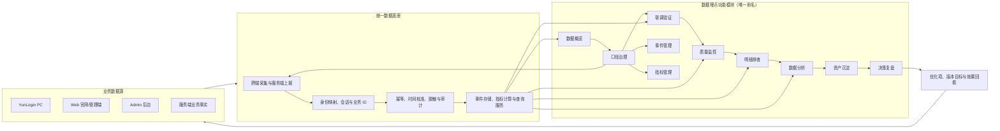
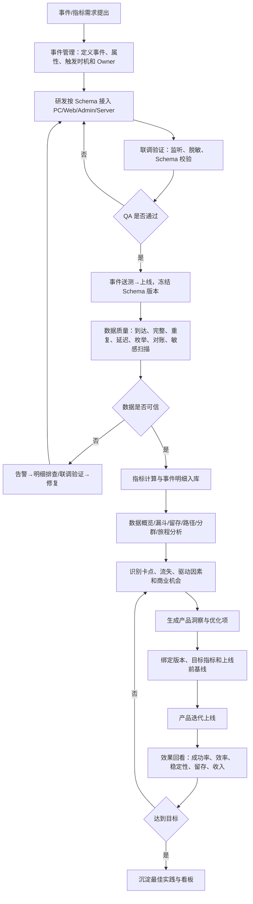
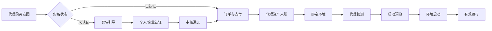
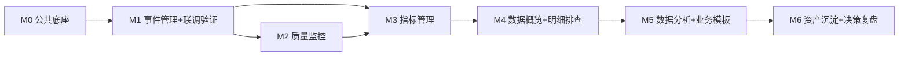

# 云登后台管理系统——数据埋点产品架构

> 文档版本：V1.0  
> 编制日期：2026-08-11  
> 产品范围：云登后台管理系统 / 数据埋点  
> 数据来源：YunLogin PC、Web、Admin、服务端  
> 依据：《云登指纹浏览器数据埋点.md》、九份数据埋点模块 PRD、云登指纹浏览器用户旅程图  
> 文档定位：产品架构、模块边界、业务闭环和分阶段建设基线；不替代数据仓库及埋点 SDK 技术设计

## 1. 产品定位

数据埋点后台不是单纯的“事件查询工具”，而是连接云登指纹浏览器业务事实、数据质量、产品分析和迭代决策的产品决策系统。

系统需要同时解决五类问题：

1. **事实是否存在**：各端是否按统一规范上报事件，事件明细记录是否可追溯；
2. **事实是否可信**：Schema、必填属性、枚举、重复、延迟、双端对账和敏感信息是否合格；
3. **用户发生了什么**：用户在哪个旅程阶段、哪个功能、哪个版本、哪个团队或哪个失败码流失；
4. **为什么发生**：是入口低效、产品理解困难、实名认证阻断、代理不可用、环境配置错误、性能问题还是权限问题；
5. **产品该做什么**：把分析结论转化为优化项，并验证迭代是否改善成功率、效率、稳定性、留存和收入。

### 1.1 北极星指标

沿用 **周成功运行环境数（WSLE）**：自然周内至少成功启动一次且有效运行不少于 60 秒的去重浏览器环境数。

WSLE 不能独立使用，必须同时观察：

- 激活用户数与首次价值时间 TTFV；
- 环境创建、代理检测和环境启动成功率；
- 代理购买、绑定、启动和有效运行的购后价值转化；
- D1、D7、D30、W4 留存；
- 团队协作、插件、RPA、API 等深度使用率；
- 套餐付费、续费、代理复购、GMV 和流失率；
- P0 事件到达率、完整率、重复率、延迟和对账差异。

## 2. 架构原则

1. **先定义事实，再消费事实**：事件和指标口径必须先治理、调试和验收，之后才能进入数据概览与数据分析。
2. **结果事件以服务端为准**：支付成功、实名认证审核、代理资产入账、环境启动结果等不能用客户端点击或成功页代替。
3. **明细可追溯，聚合可解释**：任何指标和漏斗都能下钻到脱敏事件样本、Schema 版本、质量状态和计算口径。
4. **统一口径跨端复用**：PC、Web、Admin、Server 使用统一事件名、属性、ID、时区、去重和版本规则。
5. **业务链路由 ID 串联**：通过 user_id、team_id、session_id、request_id、trace_id、order_id、proxy_id、environment_id 连接跨端旅程。
6. **分析必须导向行动**：分析结果应能保存为看板、形成洞察、创建优化项，并在版本上线后自动回看效果。
7. **隐私最小化**：不采集密码、Cookie、2FA、代理密码、证件、银行卡等原文；明细、导出和调试均需脱敏与审计。
8. **质量不达标不得下结论**：指标卡、漏斗和分析结果必须显示数据质量、更新时间、统计范围和是否完整。

### 2.1 统一模块命名口径

本文档及其关联的系统框架 PRD、模块 PRD、菜单、面包屑、页面标题、PRD 文件名和 HTML 文件名，必须使用下表中的唯一名称。不得再为同一模块并列使用“阶段名”“工作台名”或“页面名”。“事件明细记录”“告警实例”“分析快照”“看板”等仅作为模块内部的数据对象或功能名称使用，不得替代模块名称。

| 菜单层级 | 唯一模块名称 | PRD 文件名 | HTML 文件名 | 说明 |
|---|---|---|---|---|
| 一级 | 数据概览 | `数据概览PRD.md` | `数据概览.html` | 直接路由 |
| 一级 | 口径治理 | — | — | 仅展开/收起，无独立页面 |
| 二级 | 事件管理 | `事件管理PRD.md` | `事件管理.html` | 口径治理子菜单 |
| 二级 | 指标管理 | `指标管理PRD.md` | 待建设 | 口径治理子菜单，M1 开放 |
| 一级 | 联调验证 | `联调验证PRD.md` | `联调验证.html` | 直接路由 |
| 一级 | 质量监控 | `质量监控PRD.md` | `质量监控.html` | 直接路由 |
| 一级 | 明细排查 | `明细排查PRD.md` | `明细排查.html` | 直接路由 |
| 一级 | 数据分析 | `数据分析PRD.md` | `数据分析.html` | 直接路由 |
| 一级 | 资产沉淀 | `资产沉淀PRD.md` | `资产沉淀.html` | 直接路由，M6 开放 |
| 一级 | 决策复盘 | `决策复盘PRD.md` | 待建设 | 直接路由，M6 开放 |

唯一一级链路为：**数据概览→口径治理→联调验证→质量监控→明细排查→数据分析→资产沉淀→决策复盘**。其中仅口径治理包含事件管理、指标管理两个二级菜单。

## 3. 总体产品架构图



闭环含义：**业务行为产生事件 → 事件被定义和上报 → 联调验证 → 质量监控 → 明细排查 → 数据分析定位问题 → 形成产品决策 → 版本上线 → 再次采集和验证效果**。

## 4. 目标信息架构

```text
云登后台 Sidebar
├─ 用户管理〔灰色静态分组标题〕
│  ├─ 用户列表
│  ├─ 用户统计
│  ├─ 团队列表
│  ├─ 企业列表
│  └─ 成员列表
├─ 订单管理〔灰色静态分组标题〕
│  ├─ 订单列表
│  └─ 套餐订单
├─ 资源管理〔灰色静态分组标题〕
│  ├─ 环境管理
│  └─ 代理列表
└─ 数据埋点〔灰色静态分组标题〕
   ├─ 数据概览〔一级，直接路由〕 /data-tracking/overview
   ├─ 口径治理〔一级，可展开，无业务路由〕
   │  ├─ 事件管理〔二级〕 /data-tracking/events
   │  └─ 指标管理〔二级〕 /data-tracking/metrics       【M1 新增】
   ├─ 联调验证〔一级，直接路由〕 /data-tracking/debug
   ├─ 质量监控〔一级，直接路由〕 /data-tracking/alerts
   ├─ 明细排查〔一级，直接路由〕 /data-tracking/event-details
   ├─ 数据分析〔一级，直接路由〕 /data-tracking/analysis
   ├─ 资产沉淀〔一级，直接路由〕 /data-tracking/dashboards【M6 开放】
   └─ 决策复盘〔一级，直接路由〕 /data-tracking/insights【M6 新增】
```

### 4.1 导航建议

1. “用户管理、订单管理、资源管理、数据埋点”都是灰色静态分组标题，不可点击、不可折叠、无路由、无选中态；
2. 数据埋点位于资源管理之后，以八个阶段型一级菜单表达完整链路：数据概览→口径治理→联调验证→质量监控→明细排查→数据分析→资产沉淀→决策复盘；
3. 只有“口径治理”建立二级菜单，因为事件管理和指标管理具有独立对象、权限、状态机和页面；其他阶段当前仅对应一个工作台，直接作为一级菜单，避免一项子菜单造成无效层级；
4. 口径治理一级行只负责展开/收起，无独立业务页；事件管理与指标管理二级菜单负责路由。模块内部继续通过 Tab、筛选和模板组织更细能力；
5. V1 显示数据概览、口径治理/事件管理、联调验证、质量监控、明细排查、数据分析；指标管理完成 M1 验收后显示；资产沉淀和决策复盘完成 M6 验收后显示；
6. 权限过滤后二级菜单为空时隐藏口径治理；所有阶段均不可见时隐藏“数据埋点”灰色标题；
7. 灰色标题不产生导航事件；一级菜单上报 `menu_level=1`，事件管理/指标管理上报 `menu_level=2`。

### 4.2 层级评估结论

| 方案 | 优点 | 主要问题 | 结论 |
|---|---|---|---|
| 九个业务页面全部扁平一级 | 跳转最快 | 用户难以从名称理解工作链路，事件/指标的治理关系弱 | 不采用 |
| 八个阶段全部建立二级菜单 | 链路最显性 | 七个阶段只有一个子项，增加点击和视觉噪音 | 不采用 |
| 阶段型一级 + 必要二级 | 链路明确，层级克制，可随能力增加扩展 | 需处理父子高亮和折叠状态 | 采用 |

## 5. 功能模块架构

| 菜单层级 | 模块 | 核心职责 | 主要输入 | 主要输出 | 核心用户 | 建设状态 |
|---|---|---|---|---|---|---|
| 一级 | 数据概览 | 一屏判断活跃、激活、实名、代理、环境、收入和数据质量 | 指标服务、质量结果 | KPI、趋势、固定漏斗、异常摘要 | 管理者、产品、运营 | 已有 PRD/原型，需增强商业与旅程视角 |
| 一级父级 | 口径治理 | 统一管理事件与指标口径、版本、引用和发布边界 | 埋点基线、业务事实 | 已发布事件与指标口径 | 埋点管理员、产品、研发、QA | 已有事件管理；指标管理 M1 新增 |
| 二级 | 事件管理 | 管理事件与属性的创建、编辑、送测、上线、废弃及版本 | 埋点基线、Schema | 可发布事件字典、属性字典、变更记录 | 埋点管理员、研发、QA | 已有 PRD/原型 |
| 二级 | 指标管理 | 统一指标公式、统计对象、去重、窗口、维度、Owner 和版本 | 事件字典、业务事实 | metricId、指标口径、血缘、对账结果 | 产品、数据、财务 | 新增，P0 |
| 一级 | 联调验证 | 按测试标识实时监听事件，校验 Schema、敏感字段和触发次数 | 调试事件流、Schema | QA pass/fail 证据、异常明细 | 研发、QA、埋点管理员 | 已有 PRD/原型 |
| 一级 | 质量监控 | 监控到达率、完整率、重复、延迟、枚举、对账和敏感误采 | 事件流、指标基线 | 告警实例、通知、确认、恢复记录 | 数据负责人、研发、安全 | 已有 PRD/原型 |
| 一级 | 明细排查 | 查询历史脱敏事件、属性、行为序列和跨端链路 | 事件事实、Schema、Trace | 明细表、详情、序列、受控导出 | 产品、数据、研发、安全 | 已有 PRD/原型 |
| 一级 | 数据分析 | 通过事件、漏斗、留存、路径和分群回答产品问题 | 指标、事件事实、分群 | 分析快照、图表、数据表、分析定义 | 产品、数据分析师 | 已有 PRD/原型，需增加模板 |
| 一级 | 资产沉淀 | 长期跟踪同一指标和分析结果，按角色共享 | 指标卡、分析快照 | 系统/团队/私有看板 | 管理者、产品、运营 | 已有 PRD；M6 开放 |
| 一级 | 决策复盘 | 把异常或分析结论转成优化项，定义版本目标并复盘 | 告警、分析、看板、版本 | 洞察、优化项、指标目标、效果结论 | 产品经理、负责人 | 新增，M6 开放 |

## 6. 数据埋点业务闭环



## 7. 核心分析场景

### 7.1 用户活跃与激活

**目标**：判断用户是否真正使用产品，而不是只打开客户端或登录。

核心指标：

- DAU/WAU/MAU：发生有效核心行为的去重用户，而非仅 `app_open`；
- 激活用户：注册后 7 日内首次成功启动环境并有效运行 ≥60 秒；
- TTFV：注册成功到首次有效运行的中位数和 P75；
- WSLE：周成功运行环境数；
- 有效运行用户占登录用户比例；
- 新用户 D1/D7/D30、W4 留存；
- 核心行为频次、运行环境数和运行天数分布。

激活漏斗：

```text
注册成功 → 登录成功 → 团队选择 → 新建环境开始 → 环境创建成功
→ 代理配置/检测成功 → 点击启动 → 启动成功 → 有效运行 60 秒
```

流失原因至少按以下维度拆分：客户端、版本、渠道、新老用户、个人/企业团队、代理来源、认证状态、失败码、国家地区、入口。

### 7.2 完整用户业务闭环

主旅程与埋点分析对应关系：

| 用户旅程阶段 | 核心事实 | 需要回答的问题 | 推荐分析 |
|---|---|---|---|
| 认知与登录 | 启动、注册、验证码、登录、会话 | 哪个渠道和登录方式转化最好？失败原因是什么？ | 事件趋势、注册/登录漏斗、版本分群 |
| 团队选择 | 团队列表、选择、切换、返回 | 用户是否选错团队？团队选择是否增加流失？ | 路径分析、选择漏斗、角色分群 |
| 创建环境 | 创建开始、Tab 切换、提交、结果、批量导入/迁移 | 哪种创建方式最常用？用户在哪个字段或校验退出？ | 创建漏斗、表单错误事件、路径分析 |
| 配置代理与账号 | 代理分类、绑定、检测、账号、指纹校验 | 代理或指纹配置是否阻断启动？ | 漏斗、失败码、代理类型分群 |
| 启动与运营 | 启动点击、预检、结果、有效运行、关闭 | 启动成功率和稳定性如何？哪些因素驱动有效运行？ | 漏斗、留存、版本对比、驱动因素分析 |
| 团队协作 | 邀请、账号导入、绑定、授权、分享转移 | 协作深度是否提升留存和扩席？权限卡点在哪里？ | 功能采用、协作漏斗、留存分群 |
| 自动化与扩展 | 插件、RPA、API 创建、运行、失败 | 自动化能力是否提升效率和留存？ | 采用漏斗、任务成功率、留存对比 |
| 安全审计 | 日志查询、告警、确认、处置 | 是否能及时发现和处理异常？ | 事件趋势、处置漏斗、MTTA/MTTR |
| 费用续费与退出 | 套餐、订单、支付、续费、回收站、退出 | 哪些价值行为驱动付费续费？流失前发生了什么？ | 商业漏斗、留存、流失路径、价值分群 |

### 7.3 订阅与套餐转化卡点

需要建立统一订阅漏斗：

```text
套餐入口曝光 → 套餐页到达 → SKU/周期选择 → 点击购买
→ 实名状态校验 → 订单创建 → 支付发起 → 支付成功
→ 权益到账 → 首次创建/启动 → 7日再次有效运行 → 续费
```

必须区分：

- 没看到入口、看到未点击、点击未到达；
- SKU 选择困难、价格或权益理解障碍；
- 实名认证阻断；
- 订单创建、支付渠道或支付结果失败；
- 权益到账异常；
- 购买后没有创建或启动环境；
- 到期前价值感不足而未续费。

后台输出：步骤人数、转化率、流失率、中位耗时、失败码 Top、版本/入口/团队/套餐分群，以及可下钻的脱敏事件样本。

### 7.4 代理购买实际转化

代理转化必须观察“支付”与“价值兑现”两段，不允许只看支付成功：

```text
代理市场到达 → 商品查看 → 地区/类型/周期选择 → 点击购买
→ 实名引导 → 认证完成 → 订单创建 → 支付成功 → 代理资产入账
→ 绑定环境 → 代理检测成功 → 环境启动成功 → 有效运行 → 7日再次运行
```

核心判断：

- 购买前卡点：入口、商品、地区、价格、自动续费、实名认证；
- 支付卡点：订单、支付渠道、优惠、失败码；
- 购后卡点：资产到账、绑定、连通性、指纹一致性、启动预检；
- 价值卡点：启动后是否有效运行、是否在 7 日内复用、是否复购。

关键指标：购买转化率、认证完成率、支付成功率、资产入账成功率、购后可用率、购后 TTFV、7 日复用率、代理复购率、退款率。

### 7.5 代理购买、实名认证与环境启动关系

使用 order_id、proxy_id、environment_id、user_id、request_id 和 trace_id 串联以下状态：



必须同时生成四类分群：

1. 已实名后购买；
2. 购买触发实名并成功恢复购买；
3. 购买成功但启动时被实名或代理问题阻断；
4. 购买成功、绑定成功但从未有效运行。

### 7.6 核心使用场景识别

不能仅按点击次数定义核心功能。核心场景应同时满足：

- 高频：使用用户多、使用次数稳定；
- 价值：与有效运行、留存、付费或续费显著相关；
- 必要：位于关键业务漏斗中，缺失会阻断核心任务；
- 稳定：成功率和性能达到可用标准；
- 可替代性低：没有更短或更可靠的替代入口。

建议系统预置以下场景分析：

| 场景 | 完成定义 | 核心指标 |
|---|---|---|
| 首次激活 | 新用户首次有效运行环境 | 完成率、TTFV、各步流失 |
| 日常运营 | 查找环境→启动→有效运行→正常关闭 | 完成率、启动耗时、异常退出率 |
| 代理购后使用 | 购买→绑定→检测→启动→复用 | 购后可用率、7 日复用率 |
| 团队协作 | 邀请→授权→绑定资源→成员有效运行 | 协作完成率、成员激活率 |
| 自动化运营 | 创建 RPA/API→执行→成功→复用 | 任务成功率、节省时长、留存贡献 |
| 安全处置 | 告警→确认→定位→处置→恢复 | MTTA、MTTR、重复发生率 |

### 7.7 高频功能、低效入口与冗余入口

功能价值矩阵使用“采用率 × 任务贡献 × 路径效率 × 结果质量”综合判断：

| 类型 | 判断特征 | 产品动作 |
|---|---|---|
| 核心高效 | 高频、高完成率、短路径、与留存/收入正相关 | 保持稳定、突出入口、重点监控 |
| 核心低效 | 高频但失败多、耗时长、绕路多 | P0/P1 优化流程与性能 |
| 非核心有效 | 低频但服务明确场景、完成率高 | 保留并精准触达目标用户 |
| 低效冗余 | 低频、低完成、被其他入口替代、无价值贡献 | 合并、降级或下线实验 |
| 误触入口 | 点击高但快速返回、无后续任务 | 修正文案、位置或交互反馈 |

需要记录入口曝光、点击、页面到达、停留、任务完成、返回方式和后续核心结果，避免用点击量单独判断入口价值。

### 7.8 激活、留存与商业价值驱动因素

数据分析提供固定的驱动因素对比，但结果表述为“相关关系”，除非通过实验或准实验验证，不直接宣称因果。

候选驱动行为：

- 首日创建环境数、首次创建方式、首次启动耗时；
- 是否完成代理检测、是否使用稳定代理、购后是否在 24 小时内启动；
- 7 日内有效运行天数、环境数、运行时长；
- 是否使用团队协作、插件、RPA 或 API；
- 是否发生启动失败、异常退出、权限阻断或敏感告警；
- 是否查看帮助、是否在失败后成功恢复；
- 套餐、团队规模、代理来源、客户端版本和国家地区。

输出：激活用户与未激活用户对比、留存 cohort 对比、付费/未付费分群、续费/流失分群，以及行为发生前后的时序约束。

### 7.9 产品迭代效果验证

每个优化项在上线前必须绑定：

- 目标问题和目标人群；
- 主指标、护栏指标和数据质量指标；
- 事件/指标版本；
- 上线前基线周期；
- 发布版本、灰度范围或 experiment_id；
- 预期方向和成功阈值。

效果回看至少展示：

| 维度 | 示例指标 |
|---|---|
| 成功率 | 登录、创建、代理检测、启动、支付、认证、任务执行成功率 |
| 效率 | TTFV、页面加载、创建耗时、启动耗时、支付耗时、任务完成时长 |
| 稳定性 | 异常退出、失败码、接口错误、重试、数据延迟、版本故障率 |
| 用户价值 | 激活、WSLE、D7/W4 留存、核心场景完成率 |
| 商业价值 | 购买转化、购后可用、GMV、客单价、复购、续费、退款 |
| 护栏 | 投诉、误删、敏感误采、越权、性能下降、其他关键漏斗下降 |

默认比较：上线前后、实验组/对照组、新旧版本、受影响入口/未受影响入口。必须标记样本量、统计周期和数据成熟度；证据不足时显示“暂无法判断”，不得自动给出确定因果结论。

## 8. 事件管理与指标管理

### 8.1 事件管理

事件管理必须支持管理员对事件进行完整治理：

- 查询：按事件名、中文名、业务域、端、优先级、状态、Owner、Schema 版本查询；
- 新增：创建事件、业务属性、公共属性引用、触发规则和分析用途；
- 编辑：草稿可编辑，上线事件必须新建版本；
- 删除：仅未被引用的草稿可物理删除，其余采用废弃；
- 状态：draft → testing → online → deprecated；
- 校验：名称唯一、类型、枚举、必填、敏感属性和引用完整性；
- 引用：展示被指标管理、数据分析、资产沉淀、质量监控和联调验证引用的情况；
- 审计：记录操作者、变更前后、时间、原因和发布证据。

### 8.2 指标管理（新增）

指标管理是跨端统一分析的必要能力。若只在各页面代码中计算指标，将再次出现同名不同义。

指标定义字段：

| 字段 | 说明 |
|---|---|
| metric_id / 名称 | 全局唯一标识和中文名称 |
| 业务域 / Owner | 归属及责任人 |
| 指标类型 | 原子指标、派生指标、比率、漏斗、留存、金额 |
| 统计对象 | 用户、团队、环境、订单、代理、任务、事件 |
| 分子/分母 | 引用事件及过滤条件 |
| 去重键 | user_id、environment_id、order_id、request_id 等 |
| 时间窗口 | 自然日/周/月、滚动窗口、最大间隔 |
| 允许维度 | 客户端、版本、团队、认证类型、代理来源等 |
| 数据源与事实端 | client/server 及优先级 |
| 版本/生效时间 | 历史口径可复现 |
| 质量门槛 | 计算和展示前必须满足的质量条件 |
| 引用关系 | 数据概览、数据分析、资产沉淀和优化项 |

核心指标修改必须新建版本；历史分析快照继续引用旧版本，不得静默重算。

## 9. 明细排查与联调验证

### 9.1 明细排查

明细排查提供对已入库历史脱敏事实的受控查询，供授权管理员排查：

- 条件：时间、团队、事件、端、版本、用户匿名 ID、session、event、request、trace、结果、质量状态；
- 列表：发生时间、接收时间、事件、端、版本、Schema、匿名主体、结果、质量标记；
- 详情：公共属性、业务属性、服务端时间、Schema 对比、质量问题、关联对象；
- 行为序列：同一会话或主体前后事件，明确 30 分钟会话边界；
- Trace 链路：客户端意图→服务端请求→业务结果→后续任务；
- 下钻：事件管理、联调验证、质量监控和数据分析；
- 导出：异步、脱敏、限时、限次、权限控制和全程审计。

明细排查不允许展示禁采原文，也不能成为绕过用户隐私阈值的工具。

### 9.2 联调验证

联调验证面向“研发完成接入、QA 进行验证”的上线前场景：

1. 创建测试会话并输入内部 ID 或不可逆哈希；
2. 监听 PC/Web/Admin/Server 实时事件流；
3. 校验必填、类型、枚举、未知属性、废弃版本和敏感字段；
4. 展示 request_id/trace_id 的跨端关联；
5. QA 标记 pass/fail 并填写原因码；
6. 通过证据同步到事件发布检查；
7. 调试失败可直接跳转事件定义，修复后重新监听。

## 10. 数据分析增强

### 10.1 基础分析能力

- 事件分析：次数、人数、环境数、人均次数、趋势和分组；
- 漏斗分析：2–10 步、有序转化、最大间隔、步骤属性和分群；
- 留存分析：日/周/月 cohort，未成熟周期不计入平均；
- 路径分析：起点或终点、3–10 步、循环合并、Top 路径；
- 用户分群：属性和行为条件、动态或快照分群、隐私阈值。

### 10.2 预置业务模板

| 模板 | 默认步骤/对象 | 主要决策 |
|---|---|---|
| 新用户激活 | 注册→登录→团队→创建→代理→启动→有效运行 | 缩短 TTFV、提升激活 |
| 订阅购买 | 套餐曝光→选择→实名→订单→支付→权益→使用→续费 | 定位订阅与续费卡点 |
| 代理首购 | 市场→商品→配置→实名→支付→入账 | 提升支付转化 |
| 代理购后价值 | 购买→绑定→检测→启动→有效运行→复用 | 避免“买了不能用” |
| 环境日常运营 | 搜索/筛选→启动→运行→关闭 | 提升核心场景效率与稳定性 |
| 团队协作 | 邀请→授权→账号/环境绑定→成员运行 | 提升团队激活与扩席 |
| 自动化采用 | 插件/RPA/API入口→配置→运行→成功→复用 | 判断进阶能力价值 |
| 安全处置 | 告警→确认→明细→定位→修复→恢复 | 降低 MTTA/MTTR |
| 版本效果 | 新旧版本/实验组在核心指标和护栏上的差异 | 验证产品迭代 |

### 10.3 分析结果标准

所有结果必须显示：统计时间、时区、团队范围、端、版本、事件/指标版本、去重键、窗口、更新时间、数据成熟度、质量状态和隐私阈值。

结果支持：查看数据表、下钻明细排查、保存分析、保存到资产沉淀、创建产品洞察；不得直接展示用户真实身份。

## 11. 决策复盘（新增）

该模块解决“分析完成后没有持续行动和效果回看”的断点。

### 11.1 洞察对象

| 字段 | 说明 |
|---|---|
| 洞察标题 | 对问题的可验证描述，不写绝对因果 |
| 来源 | 总览卡片、告警、分析快照、看板或人工录入 |
| 证据 | analysisSnapshotId、metricId、时间、分群、质量状态 |
| 影响旅程 | 登录、团队、创建、代理、启动、协作、自动化、审计、续费 |
| 问题类型 | 流失、失败、低效、稳定性、商业、质量、安全 |
| 影响范围 | 用户/团队/端/版本/国家地区/入口 |
| 建议动作 | 产品、技术、运营或数据治理措施 |
| 优先级 | P0/P1/P2/P3 |
| 负责人/状态 | 待评审、已采纳、开发中、已上线、已验证、无效、关闭 |
| 目标指标 | 主指标、护栏指标、数据质量指标 |
| 版本关联 | 需求、发布版本、实验 ID、上线时间 |
| 效果结论 | 改善、无显著变化、恶化、证据不足 |

### 11.2 决策闭环

```text
发现异常/机会 → 保存分析快照 → 创建洞察 → 评审优先级
→ 关联优化需求和版本 → 固化上线前基线 → 上线/灰度
→ 自动生成效果回看 → 产品确认结论 → 沉淀或继续迭代
```

## 12. 数据模型与跨模块关系

| 对象 | 唯一标识 | 核心关系 |
|---|---|---|
| TrackingEvent | eventDefinitionId | 拥有多个 SchemaVersion，引用属性字典 |
| SchemaVersion | schemaVersionId | 被调试、明细和质量结果引用 |
| PropertyDefinition | propertyDefinitionId | 可被多个事件复用 |
| MetricDefinition | metricId | 引用事件版本、计算规则和质量门槛 |
| EventDetail | eventId | 关联用户匿名 ID、团队、会话、Trace、Schema 和质量结果 |
| DebugSession | debugSessionId | 产生调试事件和 QA 验证证据 |
| AlertRule/Instance | ruleId/alertId | 关联事件、指标、维度和处置记录 |
| AnalysisDefinition | analysisId | 产生不可变 analysisSnapshotId |
| Cohort | cohortId | 供数据分析、资产沉淀和效果对比使用 |
| Dashboard | dashboardId | 由指标或分析快照卡片组成 |
| ProductInsight | insightId | 引用分析/告警/指标并关联优化项 |
| ReleaseEvaluation | evaluationId | 绑定版本、实验、基线、目标和效果结论 |
| AuditRecord | auditId | 记录所有治理、导出、权限和决策变更 |

## 13. 跨端统一上报与指标口径

### 13.1 统一公共属性

所有端统一携带：event_id、event_time、server_time、user_id、anonymous_id、session_id、team_id、role、client、os、app_version、build_no、page_id、source_page、source_module、entry_point、experiment_ids、trace_id、request_id、event_schema_version。

### 13.2 上报规则

1. 事件名使用对象_动作_结果的小写蛇形命名；
2. 曝光、点击、请求和结果拆分，避免一个事件表达多个事实；
3. 同一 event_id 幂等，重试不得重复计数；
4. 异步链路使用相同 request_id，跨服务使用 trace_id；
5. 支付、认证、代理入账、环境启动结果由服务端上报；
6. 客户端时间仅描述行为发生，服务端时间用于入库和延迟判断；
7. event_schema_version 必传，破坏性变更必须新版本；
8. 禁采字段在 SDK、接入层、调试和存储前四层拦截。

### 13.3 统一计算规则

- 用户指标以内部匿名 user_id 计算；登录前通过 anonymous_id 衔接，登录后建立映射；
- 环境指标以 environment_id 计算；启动请求以 launch_request_id 去重；
- 订单与金额以服务端 order_id 和最小货币单位计算；
- 会话默认 30 分钟无操作切分；
- 时间统一存 UTC，展示按用户选择时区；
- 分母为 0 显示“—”，未成熟周期不计入平均；
- 历史分析引用当时的事件和指标版本，不随新口径静默变化。

## 14. 权限、安全与审计

| 角色 | 主要能力 | 明细权限 |
|---|---|---|
| 超级管理员 | 全模块配置和权限管理 | 可看脱敏明细，不可看禁采原文 |
| 产品经理 | 数据概览、数据分析、资产沉淀、决策复盘 | 默认聚合；按授权申请明细 |
| 数据分析师 | 指标管理、数据分析、分群、质量监控 | 可看授权团队脱敏明细 |
| 埋点管理员 | 事件、属性、Schema 和发布 | 调试与技术元数据 |
| 研发/QA | 联调验证、问题定位 | 测试环境明细；生产严格受限 |
| 运营 | 授权总览与看板 | 无用户级明细 |
| 安全审计 | 敏感扫描、访问和变更审计 | 脱敏审计数据 |

安全规则：

- 行列级权限由服务端裁剪，前端隐藏不能替代授权；
- IP、终端和设备标识按角色脱敏；
- 用户明细、导出、生产调试和完整标识查看都需审计；
- 分群人数低于隐私阈值显示区间，不显示精确值；
- 分享链接只包含 definitionId，不携带用户标识或原始过滤值；
- 敏感误采为零容忍，命中立即阻断并告警。

## 15. 分阶段建设规划

| 阶段 | 产品模块 | 核心交付 | 准入下一阶段条件 |
|---|---|---|---|
| M0 公共底座 | 路由、权限、筛选、异步任务、脱敏、审计 | 统一跨模块契约 | 公共组件和权限验收通过 |
| M1 定义与验证 | 事件管理、联调验证 | 可定义、接入、校验、QA验收 | P0完整率≥99.5%，敏感误采=0 |
| M2 质量保障 | 质量监控 | 可发现、通知、确认、恢复 | 七类规则故障演练通过 |
| M3 指标与总览 | 指标管理、数据概览 | 统一口径和管理层健康视图 | 业务对账差异<0.5% |
| M4 明细排查 | 明细排查 | 聚合异常可通过事件记录、行为序列和 Trace 定位到脱敏事实 | 权限、脱敏、导出和审计通过 |
| M5 自助分析 | 数据分析及业务模板 | 可回答激活、留存、商业和流失问题 | 九类模板验收通过 |
| M6 决策沉淀 | 资产沉淀、决策复盘 | 沉淀看板与洞察，完成产品迭代效果回看 | 看板编辑、洞察状态和版本回看通过 |

### 15.1 开发依赖



## 16. 现有规划与目标架构差距

| 能力 | 当前基础 | 差距 | 建议 |
|---|---|---|---|
| 事件定义与 CRUD | 事件管理 PRD/原型完整 | 无独立指标字典 | 新增指标管理，禁止页面各自计算 |
| 联调验证 | 联调验证 PRD/原型完整 | 需强化跨端 Trace 和发布证据 | 按 request_id/trace_id 展示完整链路 |
| 明细排查 | 明细排查 PRD/原型完整 | 需支持从业务分析直接下钻 | 统一携带筛选快照和质量上下文 |
| 数据分析 | 五类分析能力完整 | 缺少用户旅程、商业、版本效果模板 | 增加九类预置模板和创建洞察动作 |
| 数据概览 | 核心指标与固定漏斗完整 | 用户活跃、订阅、核心场景与驱动分析不够聚合 | 重组为健康、激活、商业、质量四个视角 |
| 质量监控 | 七类规则和状态机完整 | 缺少业务指标异常与版本回归监控 | 增加关键转化率/成功率版本基线 |
| 资产沉淀 | PRD 已有，导航暂缓 | 尚未形成长期决策资产 | 完成画布能力后开放 |
| 决策复盘 | 当前无独立对象 | 分析结论无法关联需求与版本 | 新增产品洞察和 ReleaseEvaluation |

## 17. 验收标准

### 17.1 功能闭环

1. 管理员可创建、查询、编辑、送测、上线和废弃事件；
2. 研发和 QA 可实时监听事件并完成 Schema 与敏感信息验证；
3. 系统可持续监控七类数据质量问题并完成告警闭环；
4. 授权用户可查询历史脱敏事件、行为序列和跨端 Trace；
5. 产品可运行事件、漏斗、留存、路径和分群分析；
6. 系统预置激活、订阅、代理、环境、团队、自动化、安全和版本效果模板；
7. 分析结果可保存到资产沉淀、创建洞察并关联优化项和版本；
8. 版本上线后可按主指标、护栏和质量指标自动回看效果。

### 17.2 数据可信

- P0 事件到达率 ≥99.5%；
- P0 必填属性完整率 ≥99.5%；
- 重复率 <0.1%；
- 实时数据延迟 P95 <5 分钟；
- 非法枚举率 0；
- 关键结果与业务服务对账差异 <0.5%；
- 敏感字段误采 0；
- 图表、数据表、导出和明细下钻使用同一查询快照。

### 17.3 产品问题覆盖

上线后应能通过后台直接回答：

1. 当前 DAU、WAU、MAU、激活、WSLE 和留存情况如何；
2. 用户在哪个旅程阶段、哪个步骤和哪个失败码流失；
3. 哪些功能是核心高效场景，哪些入口低效、误触或冗余；
4. 代理购买、实名认证、绑定、检测、启动和有效运行的真实转化关系；
5. 哪些行为与激活、留存、付费和续费相关；
6. 某次产品迭代是否改善成功率、效率、稳定性、留存和收入；
7. PC、Web、Admin、Server 是否按同一口径上报和计算；
8. 数据是否可信，异常能否被及时发现、定位、处理并恢复。

## 18. 事实与判断边界

### 已核实事实

- 《云登指纹浏览器数据埋点.md》已定义北极星指标、公共属性、核心业务实体、全平台事件、漏斗、质量和隐私规则；
- 项目已有数据概览、事件管理、明细排查、数据分析、联调验证、质量监控和资产沉淀七份模块 PRD；
- 当前 App Shell 原型已展示完整八阶段链路；指标管理、资产沉淀和决策复盘按 M1/M6 状态标记，现有业务原型页面均使用统一模块名称；
- 用户旅程覆盖登录、团队、创建、代理与账号、启动、协作、自动化、安全审计、费用续费和退出。

### 架构判断与新增建议

- “指标管理”与“决策复盘”是本架构为闭合统一口径和产品迭代验证而新增的产品能力；
- 驱动因素分析默认只表达相关关系，未经实验验证不能自动宣称因果；
- 自动生成根因或优化结论不应作为 V1 能力，系统应先提供可解释证据、分析模板和人工确认流程。
