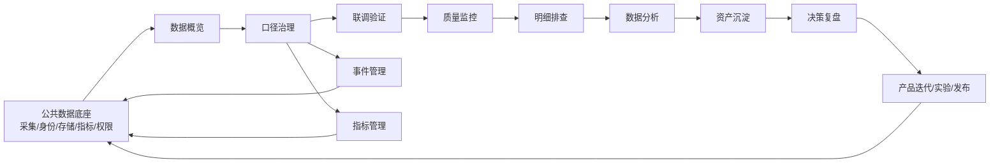

# 云登后台管理系统——数据埋点产品规划

> 产品：云登后台管理系统  
> 规划范围：云登指纹浏览器 PC/Web/Server/Admin 多端埋点治理、调试、质量、分析与决策闭环  
> 规划周期：M0～M6（未获得确定人力和发布时间，不虚构自然日排期）  
> 优先级：平台级 P0  
> 文档状态：规划基线  
> 更新日期：2026-08-11

## 1. 规划结论

数据埋点不是单一报表功能，而是一套从“定义业务事实”到“验证产品改进”的产品基础设施。目标架构由八个一级模块构成：数据概览、口径治理、联调验证、质量监控、明细排查、数据分析、资产沉淀、决策复盘；口径治理包含事件管理、指标管理两个二级模块。公共数据底座为跨模块能力，不计入导航模块数量。

产品使用链路统一为：数据概览→口径治理→联调验证→质量监控→明细排查→数据分析→资产沉淀→决策复盘。建设依赖仍遵循先统一口径、再验证上报、再保障质量、再开放消费、最后沉淀决策。任何聚合指标必须能够追溯到指标版本、事件版本和脱敏事件记录；任何产品洞察必须能够转化为行动，并在发布后按原口径复盘。

## 2. 事实、推测与规划判断

### 2.1 已核实的产品事实

1. 《云登指纹浏览器数据埋点.md》已定义跨注册、登录、代理、实名、环境、团队、插件、API/RPA 等业务域的事件与指标框架；
2. 现有后台 PRD 已覆盖数据概览、事件管理、明细排查、数据分析、联调验证、质量监控和资产沉淀；
3. 现有产品架构明确提出新增指标管理、决策复盘，并增强预置业务分析模板；
4. 支付、实名认证审核、代理资产入账、环境启动结果必须以服务端事实为准，客户端点击仅能作为过程事件；
5. 用户旅程需回答订阅、代理购买、实名认证、环境创建与启动、有效运行、留存和商业价值之间的真实转化关系。

### 2.2 尚待数据验证的假设

1. 代理购买、实名认证和环境启动可能是首次价值体验的主要卡点；
2. 环境成功启动并有效运行可能比创建环境更能解释后续留存；
3. 代理购买后的绑定、检测和有效运行可能比支付成功更能解释复购；
4. 某些高曝光入口可能转化低，某些低曝光入口可能在特定分群中效率更高；
5. 版本稳定性、启动时延和异常退出可能显著影响激活与留存。

以上均为待验证假设，不应在有数据前写成确定结论。

## 3. 产品目标与非目标

### 3.1 产品目标

1. 建立跨端统一的事件、属性、指标、分群和时间口径；
2. 形成事件定义、开发联调、QA 验证、发布监控、异常排查和治理迭代闭环；
3. 让管理员可通过明细排查查询脱敏事件记录，并从指标下钻到可解释证据；
4. 让产品经理识别订阅、代理购买、实名认证、环境启动等关键旅程的流失步骤；
5. 识别核心使用场景、高频功能、低效入口和冗余入口；
6. 量化激活、留存、商业价值的行为驱动因素；
7. 验证产品迭代是否改善成功率、效率、稳定性和收入；
8. 监控各端上报、指标计算和分析任务的异常。

### 3.2 非目标

- 不建设自由 SQL、永久用户画像或真实身份检索；
- 不采集或展示密码、Cookie、证件原文、代理凭证等禁采数据；
- 不以相关性自动宣称因果关系；
- 不由后台直接修改 YunLogin 客户端业务流程；
- V1 不提供自动生成产品结论或自动执行产品决策。

## 4. 用户与核心任务

| 角色 | 核心任务 | 主要模块 |
|---|---|---|
| 产品经理 | 判断健康度、定位漏斗卡点、验证迭代效果 | 数据概览、数据分析、决策复盘 |
| 数据分析师 | 定义指标、构建分析、核对明细 | 指标管理、数据分析、明细排查 |
| 埋点管理员 | 治理事件、属性、版本和发布状态 | 事件管理、联调验证 |
| 研发 | 对接 Schema、联调事件、排查链路 | 事件管理、联调验证、明细排查 |
| QA | 验证触发时机、次数、属性和版本 | 联调验证、事件管理 |
| 运营/代理负责人 | 查看授权业务转化与趋势 | 数据概览、资产沉淀 |
| 安全/审计 | 监控敏感字段、访问和导出 | 质量监控、审计记录 |
| 管理者 | 查看可信核心指标和决策进展 | 数据概览、资产沉淀、决策复盘 |

## 5. 产品架构与闭环



闭环完成标准：每条洞察必须关联分析快照、指标版本、适用分群与时间范围；每项行动必须关联负责人、目标指标、基线、目标值和观察窗；复盘结果必须回写为达成、部分达成、未达成或证据不足。

## 6. 目标信息架构

```text
用户管理〔灰色静态标题，不可点击〕
├─ 用户列表
├─ 用户统计
├─ 团队列表
├─ 企业列表
└─ 成员列表
订单管理〔灰色静态标题，不可点击〕
├─ 订单列表
└─ 套餐订单
资源管理〔灰色静态标题，不可点击〕
├─ 环境管理
└─ 代理列表
数据埋点〔灰色静态标题，不可点击〕
├─ 数据概览〔一级〕
├─ 口径治理〔一级，可展开〕
│  ├─ 事件管理〔二级〕
│  └─ 指标管理〔二级，M1 验收后显示〕
├─ 联调验证〔一级〕
├─ 质量监控〔一级〕
├─ 明细排查〔一级〕
├─ 数据分析〔一级〕
├─ 资产沉淀〔一级，M6 验收后显示〕
└─ 决策复盘〔一级，M6 验收后显示〕
```

| 一级菜单 | 二级菜单/落地页 | 定位 | 阶段 |
|---|---|---|---|
| 数据概览 | 直接进入数据概览 | 核心健康度、商业转化和质量摘要 | M3 |
| 口径治理 | 事件管理 | 事件与属性 Schema 治理 | M1 |
| 口径治理 | 指标管理 | 指标口径、版本、血缘、试算和发布 | M1 |
| 联调验证 | 直接进入联调验证 | 测试会话监听、校验和 QA 证据 | M1 |
| 质量监控 | 直接进入质量监控 | 质量规则、通知、确认和恢复 | M2 |
| 明细排查 | 直接进入明细排查 | 历史脱敏事件查询和行为序列 | M4 |
| 数据分析 | 直接进入数据分析 | 五类分析和预置业务模板 | M5 |
| 资产沉淀 | 直接进入资产沉淀 | 聚合卡片组织、共享和订阅 | M6 |
| 决策复盘 | 直接进入决策复盘 | 证据到行动再到复盘 | M6 |

菜单分组标题仅用于信息分隔，不进入 Tab 顺序、不绑定点击事件。“口径治理”是唯一带折叠箭头的一级菜单，父级高亮与当前二级页面同步；其余一级菜单直接路由。只有当一个阶段形成至少两个独立工作台时才新增二级菜单，页面内部 Tab 不升级为侧栏层级。公共底座不单独作为导航页面，包含 RBAC、团队数据范围、公共筛选、事件/属性/指标选择器、异步任务、审计、脱敏和统一错误模型。

## 7. 核心业务分析场景

### 7.1 新用户激活闭环

注册成功 → 登录成功 → 创建/导入环境 → 配置代理 → 必要时实名认证 → 启动环境 → 启动成功 → 有效运行 ≥60 秒 → 7 日再次有效运行。

输出：各步人数/环境数、步间转化率、耗时中位数/P75、失败原因、版本/端/新老用户分群、流失用户的上一成功步骤。

### 7.2 订阅与套餐转化

权益入口曝光 → 套餐页到达 → 套餐对比 → 下单 → 支付成功 → 权益生效 → 首次使用权益 → 续费。

必须区分“未进入”“进入未下单”“下单未支付”“支付成功未生效”“生效未使用”，避免把所有流失归因于价格。

### 7.3 代理购买与实际使用

代理入口曝光 → 市场到达 → 商品查看 → 规格选择 → 实名任务 → 订单创建 → 支付成功 → 代理资产入账 → 绑定环境 → 代理检测成功 → 环境有效运行 → 7 日再次运行/复购。

商业转化以资产入账为交付事实，价值转化以绑定并有效运行为使用事实。

### 7.4 实名认证与任务恢复

实名引导曝光 → 去认证 → 认证页到达 → 提交 → 审核通过/失败 → 返回原任务 → 原任务完成。个人与企业认证必须独立分群。

### 7.5 核心场景与入口效率

- 核心使用场景：由使用人数、频次、有效运行关联、留存提升和商业价值共同判定；
- 高频功能：报告用户覆盖率、频次中位数和重复使用间隔；
- 入口效率：入口曝光→目标任务完成，兼顾到达率、完成率和完成耗时；
- 冗余入口：需同时满足低曝光、低转化、低独特贡献，不能仅因点击少直接删除。

### 7.6 用户活跃情况

用户活跃同时观察 DAU/WAU/MAU、WAU/MAU、活跃环境数、有效运行环境数、人均有效运行次数和活跃天数分布，并按新老用户、个人/团队、端、版本和是否付费分群。仅登录但未发生有效业务行为的用户单独标记为“浅层活跃”，不得与完成环境有效运行的“价值活跃”混为同一结论。

## 8. 指标体系

| 层级 | 指标示例 | 说明 |
|---|---|---|
| 北极星 | WSLE | 周内成功启动且有效运行的去重环境数 |
| 激活 | 激活率、TTFV、首日有效运行率 | 从注册到首次价值 |
| 活跃 | DAU/WAU/MAU、活跃环境、有效运行次数 | 用户和环境双主体 |
| 留存 | D1/D7/D30 用户留存、环境再运行率 | 排除未成熟周期 |
| 商业 | 订阅支付率、代理入账率、购后有效使用率、GMV | 区分支付、交付和使用 |
| 效率 | 任务成功率、步骤耗时、重试次数 | 任务级而非单击级 |
| 稳定性 | 启动成功率、异常退出率、P95 启动时长 | 按版本/端分群 |
| 数据质量 | 到达率、完整率、重复率、非法枚举率、延迟 | 决定数据可用性 |

所有指标必须记录 metric_id、版本、主体、分子、分母、窗口、去重规则、过滤条件、时区、归因窗口、数据源、Owner 和状态。

## 9. 版本路线图与准入门槛

| 阶段 | 范围 | 关键产出 | 准入下一阶段门槛 |
|---|---|---|---|
| M0 公共底座 | RBAC、筛选、审计、异步任务、脱敏、统一响应 | 跨模块公共契约 | 权限、错误、状态和审计测试通过 |
| M1 事实治理 | 事件管理、指标管理、联调验证 | 定义并验证事件和指标 | P0 事件/指标可追溯，敏感误采为 0 |
| M2 质量保障 | 质量监控 | 发现、通知、确认、恢复 | 七类质量规则故障演练通过 |
| M3 固定消费 | 数据概览 | 可信核心指标与业务漏斗 | 业务对账差异 <0.5%，卡片独立容错 |
| M4 明细排查 | 明细排查 | 聚合到明细的解释链 | 越权读取为 0，查询/导出审计 100% |
| M5 自助分析 | 数据分析、业务模板 | 可复用的漏斗/留存/路径分析 | 五类分析与模板口径验收通过 |
| M6 决策沉淀 | 资产沉淀、决策复盘 | 共享、行动、复盘闭环 | 布局并发、权限、决策复盘全部通过 |

## 10. 优先级与依赖

### P0

- 公共底座、事件管理、指标管理、联调验证、质量监控；
- 激活、代理首购、实名认证、环境启动的核心事实事件；
- 服务端结果事件与业务订单/资产/认证记录对账。

### P1

- 数据概览、明细排查、数据分析及预置业务模板；
- 订阅、代理购后价值、核心场景、入口效率、版本效果分析；
- 看板基础共享与产品洞察追踪。

### P2

- 高级归因、智能异常解释、跨看板订阅、辅助洞察推荐；
- 仅在 P0/P1 数据质量稳定后进入规划。

## 11. 权限、隐私与治理

1. 服务端先做租户/团队裁剪、字段权限和脱敏，前端不接收无权字段；
2. 禁采字段不能因管理员权限而放开；
3. 明细排查查询、详情、复制、行为序列、导出全部审计；
4. 导出绑定不可变查询快照、字段白名单、过期时间和下载次数；
5. 线上事件和指标不可原地破坏性修改，必须新建版本；
6. 洞察只保存脱敏聚合证据和分析快照，不复制用户明细；
7. 相关性分析明确标记“相关而非因果”，实验结果需记录样本与显著性边界。

## 12. 风险与应对

| 风险 | 影响 | 应对 |
|---|---|---|
| 各端口径不一致 | 漏斗失真 | Schema 版本、公共属性、服务端结果事实、联调验证准入 |
| 事件很多但无人治理 | 事件污染 | Owner、状态机、引用关系、废弃机制和审计 |
| 指标重复建设 | 管理层看到不同答案 | 指标管理作为唯一发布入口，展示 metric_id/version |
| 明细能力过度开放 | 隐私泄露 | 最小权限、脱敏、限时限次导出和全量审计 |
| 把相关性当因果 | 错误决策 | 洞察证据等级、对照组/实验信息和人工评审 |
| 看板先于底座 | 固化错误口径 | M6 才开放自助画布，不复制计算逻辑 |
| 未确定资源和排期 | 计划失真 | 使用阶段门槛；资源确认后再拆自然日版本 |

## 13. 产品级验收标准

1. 八个一级模块与口径治理下两个二级模块形成概览、治理、验证、监控、排查、分析、沉淀、复盘闭环；
2. P0 事件和指标均可追溯 Owner、版本、Schema、血缘和 QA 证据；
3. 激活、订阅、代理购买、实名认证、环境启动五类旅程均有预置分析模板；
4. 聚合指标可通过明细排查下钻到授权范围内的脱敏事件记录；
5. 指标口径变更不会静默改写历史结果；
6. 各端可按统一公共属性上报，服务端结果事实可与业务记录对账；
7. 产品迭代可保存基线、目标、观察窗和复盘结论；
8. 权限越权、禁采字段泄漏和未审计导出均为 0；
9. Loading、Empty、Error、Forbidden、Stale、Extreme 均有恢复路径；
10. 产品规划中的假设在数据验证前不被表述为确定结论。
