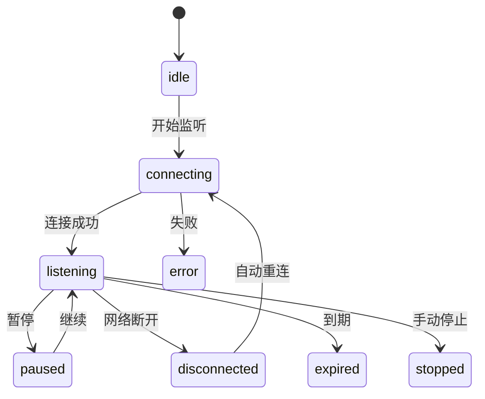

# 联调验证 PRD

> 所属模块：数据埋点 / 联调验证
> 路由：`/data-tracking/debug` 
> 优先级：P0 
> 状态：可直接用于 Vibecoding

## 1. 问题陈述

研发和 QA 缺少安全的实时上报检查工具，难以验证事件是否触发、次数是否正确、Schema 是否匹配、request_id/trace_id 是否贯通。直接查看日志容易泄露敏感载荷；高频事件还会导致页面卡顿和重要事件被淹没。

## 2. 解决方案

提供有时限的调试会话：按测试标识连接、实时监听、暂停、过滤、固定、展开脱敏属性、复制脱敏 JSON，并为事件记录 Schema 校验与 QA 结论。界面最多保留 500 条，服务端负责权限、脱敏和敏感扫描。

## 3. 用户故事

1. 作为 QA，我想按测试 user/session/event/request/trace 标识监听事件。
2. 作为研发，我想查看端、版本、时间和链路 ID。
3. 作为 QA，我想看到缺失属性、非法枚举和类型错误。
4. 作为安全人员，我想让敏感值始终显示为 REDACTED。
5. 作为 QA，我想暂停流入以检查已有事件。
6. 作为 QA，我想固定重要事件避免被淘汰。
7. 作为研发，我想复制脱敏 JSON 用于工单。
8. 作为 QA，我想标记验证通过/失败并填写非敏感备注。
9. 作为用户，我想在断线后自动重连并知道丢失范围。
10. 作为用户，我想清空本地视图但不删除服务端数据。

## 4. 页面结构

```text
FilterSection
├─ 标识类型 + 标识值 + 环境 + 有效期
└─ 开始监听 / 停止
DataSection
├─ ConnectionBar：状态 / 倒计时 / 接收数 / 丢弃数
├─ Toolbar：事件/端/校验/关键字 / 暂停 / 清空
├─ StreamList（虚拟列表）
└─ EventDetailDrawer：属性树 / 校验 / 链路 / QA验证
```

桌面端列表与详情 Drawer；详情宽 680px。列表列：接收时间、事件名、客户端、版本、Schema 版本、校验结果、属性数、固定、操作。

## 5. 调试会话规则

| 项目 | 规则 |
|---|---|
| 标识类型 | user_id、anonymous_id、session_id、event_id、request_id、trace_id |
| 标识值 | 仅提交不可逆哈希/内部 ID；禁止手机号、证件号 |
| 环境 | test/staging；production 仅超管且默认禁止 |
| 有效期 | 15/30/60 分钟，默认 30 |
| 并发 | 单用户最多 3 个活动会话 |
| UI 容量 | 500 条；固定事件不淘汰 |
| 服务端保留 | 调试元数据 7 天；敏感值不落库 |
| 连接 | WebSocket/SSE 语义；原型用定时器 Mock |

## 6. 状态机



自动重连 1/2/5/10 秒退避，最多 5 次；重连成功后显示断线区间和服务端补发数量。无法补发时明确“断线期间可能缺失 N 秒数据”。

## 7. 数据结构校验与详情

校验结果：valid、missing_required、type_mismatch、invalid_enum、unknown_property、deprecated_schema、sensitive_detected。详情显示期望类型/实际类型类别、规则和字段 key，但 sensitive_detected 不显示原值。

属性树按公共属性/业务属性/未知属性分组；默认折叠大对象；数组最多预览 20 项。复制 JSON 必须经过二次脱敏管道，包含 `redactedFields` 和 `schemaVersion`。

QA 验证状态：unverified/pass/fail。pass 必须所有 P0 必填属性 valid；fail 必须选择原因码，备注 ≤300 字且经过敏感扫描。

## 8. 交互与状态管理

1. 开始监听创建 debugSessionId，成功后锁定标识条件；
2. incomingQueue 每 200ms 批量写入 UI，避免逐事件重绘；
3. 暂停时服务端继续接收，UI 缓冲最多 1000 条；继续时批量合并；
4. 超过 500 条从最旧非固定事件淘汰并增加 discardedCount；
5. 全部 500 条均固定时停止新增到 UI并提示取消固定；
6. 清空只清 currentView，不终止会话、不删除服务端记录；
7. 停止需确认；停止后保留当前视图直到离页；
8. 点击行打开详情并设置 activeEventId；被淘汰的活动行在 Drawer 关闭后移除；
9. 标记验证成功后刷新事件管理的发布检查证据；
10. 切路由时活动会话提示“后台继续/停止并离开/取消”。

## 9. 加载中、空状态、错误 与边界

| 状态 | 表现 |
|---|---|
| idle | “输入测试标识并开始监听” |
| connecting | 连接进度，按钮变“连接中…” |
| listening Empty | “正在监听，尚未收到事件” |
| paused | 顶部黄色状态条和缓冲数量 |
| disconnected | 显示重连次数和断线起点 |
| expired | “调试会话已到期”，可复用条件新建 |
| error | 保留条件，展示原因和重试 |
| Forbidden | 缺少 `tracking.debug.read`；不展示旧数据 |
| 高频 | 200ms 批处理；500 条虚拟列表 |
| 超长 JSON | 属性树虚拟化，不一次性渲染全文 |

## 10. 权限与安全

权限：`debug.read/create/verify/production`。production 调试需要超管、二次确认、15 分钟上限和审计。服务端在传输前脱敏，前端再次防御性脱敏。禁止查询手机号、身份证、真实姓名、Cookie、密码、2FA、代理凭证或完整 IP。

## 11. 接口契约

| 场景 | 接口 |
|---|---|
| 创建会话 | `POST /api/v1/tracking/debug-sessions` |
| 事件流 | `GET /api/v1/tracking/debug-sessions/{id}/stream` |
| 停止 | `POST /api/v1/tracking/debug-sessions/{id}/stop` |
| 补发 | `GET /api/v1/tracking/debug-sessions/{id}/events?after=` |
| 验证 | `POST /api/v1/tracking/debug-events/{id}/verification` |

错误：INVALID_IDENTIFIER、SESSION_LIMIT、SESSION_EXPIRED、STREAM_INTERRUPTED、SENSITIVE_QUERY_BLOCKED、SCHEMA_NOT_FOUND。

## 12. 正式文案

- 初始：“输入测试标识并开始监听”
- 监听空：“正在监听，尚未收到事件”
- 暂停：“监听已暂停，事件仍在后台缓冲”
- 容量：“仅保留最近 500 条事件”
- 脱敏复制：“已复制脱敏数据”
- 敏感命中：“检测到禁止采集的数据，原值已隐藏”

## 14. 测试决策

以 `debugSessionState + incomingQueue + currentView` 测试。验收：

1. 状态机和自动重连准确；
2. 500 条淘汰且固定项保留；
3. 暂停缓冲和继续合并无重复；
4. 清空不停止会话；
5. 敏感值在 UI/复制/日志中均不存在；
6. Schema 校验分类正确；
7. QA 证据同步事件管理；
8. 权限、生产二次确认和审计正确。

## 15. 非目标范围

修改/重放生产事件、显示原始敏感载荷、长期日志检索、网络抓包和客户端远程控制。

## 16. 页面布局详细规格（V1.1 补充）

```text
Main / PageContainer（24px）
├─ SessionControlBar（72px）
│ ├─ 测试用户/设备/端/版本
│ ├─ 开始或停止会话
│ └─ 连接状态 / 剩余时间 / 已接收数
└─ DebugWorkspace（高度至少 680px）
 ├─ EventStream（42%）
 │ ├─ FilterToolbar（48px）
 │ └─ VirtualEventList（独立滚动）
 └─ Inspector（58%）
 ├─ Tabs：概要 / 属性 / Schema 校验 / 脱敏载荷 / 链路
 ├─ InspectorBody（独立滚动）
 └─ ValidationActions（64px，sticky）
GlobalLayer
├─ StartSessionDialog（640px）
├─ EndSessionDialog（520px）
└─ SensitiveRuleDrawer（720px）
```

会话控制条始终可见；running 时锁定调试目标但允许停止。事件行高 56px，最多保留 500 条；用户向上查看时不强制滚底。Inspector 未选择事件时显示引导，选中后不因新事件到达自动跳走。属性表展示 key、脱敏值、类型、必填、校验结果。

1024–1279px 时 EventStream 36%、Inspector 64%，不得把 Inspector 改成弹窗。断线横幅位于控制条下，不覆盖事件流。连接中、运行中、重连中、已停止、已过期五种状态不得造成布局跳动。

布局验收：选中事件被淘汰时有明确提示；敏感命中只显示规则和字段名；Drawer/Dialog 叠加时 Portal、焦点和滚动锁配对；500 条事件、超长属性、空流和网络重连均可演示。
