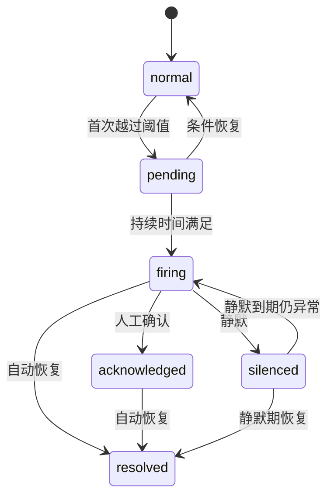

# 质量监控 PRD

> 所属模块：数据埋点 / 质量监控
> 路由：`/data-tracking/alerts` 
> 优先级：P0 
> 状态：可直接用于 Vibecoding

## 1. 问题陈述

P0 事件缺失、属性不完整、重复、延迟、枚举非法或客户端/服务端对账差异会直接破坏产品决策。仅靠人工查看看板无法及时发现问题；告警若缺少持续时间、去重、抑制、确认和恢复状态，又会造成噪音和责任不清。

## 2. 解决方案

建设质量规则和告警实例两级能力：配置固定阈值或 7 日同时间基线，持续满足条件后触发；支持通知渠道、负责人、维护窗口、确认、恢复、静默和历史审计。提供到达率、完整率、重复率、延迟、非法枚举、双端差异和敏感扫描七类规则。

## 3. 用户故事

1. 作为数据负责人，我想监控 P0 事件到达率。
2. 作为研发，我想按客户端和版本定位异常。
3. 作为数据负责人，我想配置固定阈值或动态基线。
4. 作为值班人员，我想确认告警并记录处理备注。
5. 作为值班人员，我想看到告警何时恢复。
6. 作为管理员，我想设置维护窗口避免发布期噪音。
7. 作为安全人员，我想对敏感扫描命中立即告警。
8. 作为用户，我想从告警下钻事件、调试和总览。
9. 作为用户，我想在规则并发编辑时避免覆盖。
10. 作为管理者，我想查看 MTTA、MTTR 和高频异常。

## 4. 页面结构

```text
FilterSection
├─ Tab：告警实例 / 规则管理
├─ 搜索 / 级别 / 状态 / 指标 / 事件 / Owner / 时间
└─ 查询 / 重置
DataSection
├─ KPI：触发中 / 未确认 / MTTA / MTTR
├─ Table
└─ Pagination
GlobalLayer
├─ AlertDetailDrawer
├─ RuleEditorDrawer
├─ AcknowledgeDialog
└─ MaintenanceDialog
```

实例表列：级别、标题、事件/范围、指标、当前值、阈值、状态、开始时间、持续时长、Owner、操作。规则表列：名称、指标、范围、比较方式、阈值/基线、持续时间、级别、渠道、状态、最近触发、操作。

## 5. 质量指标与默认阈值

| 指标 | P0 默认 | P1–P3 默认 | 语义 |
|---|---:|---:|---|
| 到达率 | <99.5% | <98% | 低于阈值异常 |
| 必填属性完整率 | <99.5% | <98% | 低于阈值异常 |
| 重复率 | ≥0.1% | ≥0.5% | 高于阈值异常 |
| 数据延迟 P95 | ≥5 分钟 | ≥30 分钟 | 高于阈值异常 |
| 非法枚举率 | >0 | ≥0.1% | 高于阈值异常 |
| 双端结果差异 | ≥0.5% | ≥2% | 高于阈值异常 |
| 敏感字段命中 | >0 | >0 | 立即 critical |

另有系统默认规则：P0 事件 10 分钟无数据；流量较 7 日同时间基线突增/骤降 ≥50%；关键成功率下降 ≥5 个百分点。

## 6. 规则编辑

字段：名称、指标、事件范围、过滤（客户端/版本/团队）、比较模式、阈值、持续时间、级别、Owner、通知渠道、重复通知间隔、恢复通知、维护窗口。

比较模式 fixed/baseline。baseline 默认 7 日同星期同时间中位数，数据不足 4 个有效样本时不触发并标记“基线不足”。持续时间 0/5/10/30/60 分钟；敏感命中固定 0。规则保存后默认 enabled。

事件范围支持单事件、业务域、优先级和全部；预计匹配事件 >500 时要求二次确认。通知渠道只保存 channelId，不在前端存密钥。

## 7. 告警状态机



同 ruleId + dimensionHash + incidentWindow 合并为同一实例，不重复创建。firing 期间按重复通知间隔发送；resolved 只发送一次恢复通知。确认不等于恢复。

## 8. 交互与状态管理

1. 新建/编辑打开 680px Drawer，dirty 离开需确认；
2. 切换指标时清空不兼容阈值单位和比较方式；
3. 保存使用 version + Idempotency-Key；成功刷新规则列表；
4. 启停使用行内开关，但服务端成功前显示 loading，不做乐观最终态；
5. 点击实例打开详情，展示趋势、时间线、维度、通知和关联事件；
6. 确认 Dialog 必选处理状态和备注；备注 ≤300 字并敏感扫描；
7. 静默必须选择时长和原因；最长 24 小时，超管可 7 天；
8. 从实例可深链到明细排查、数据分析、联调验证并携带时间/事件/版本；
9. 权限撤销时关闭编辑并重新加载规则；
10. VERSION_CONFLICT 显示最新规则，不覆盖本地草稿。

## 9. 加载中、空状态、错误 与边界

| 状态 | 表现 |
|---|---|
| 首屏 Loading | KPI 和表格骨架 |
| 默认 Empty 实例 | “当前没有质量监控” |
| 默认 Empty 规则 | “暂无告警规则”，展示新建 |
| 筛选 Empty | “未找到符合条件的告警” |
| 局部 Error | 趋势/通知记录独立失败并可重试 |
| 基线不足 | 状态“数据不足”，不判正常或异常 |
| 通知失败 | 实例仍 firing，显示渠道失败并可重试 |
| 规则失效 | 事件/属性废弃后 disabled_invalid，需修复 |
| 告警风暴 | 同类 5 分钟聚合，显示影响维度数 |
| Extreme | 当前值极大时单位格式化并保留原值 Tooltip |

## 10. 权限、安全与审计

权限：`alert.read/create/update/enable/acknowledge/silence`。所有规则变更、启停、确认、静默和通知重试写审计。运营只读；敏感告警详情不显示原始值，只显示规则、事件、端、版本和计数。

## 11. 接口契约

| 场景 | 接口 |
|---|---|
| 实例列表/详情 | `GET /api/v1/tracking/alert-instances`、`GET /api/v1/tracking/alert-instances/{id}` |
| 规则列表/保存 | `GET/POST/PATCH /api/v1/tracking/alert-rules` |
| 启停 | `POST /api/v1/tracking/alert-rules/{id}/transition` |
| 确认 | `POST /api/v1/tracking/alert-instances/{id}/acknowledge` |
| 静默 | `POST /api/v1/tracking/alert-instances/{id}/silence` |
| 通知重试 | `POST /api/v1/tracking/alert-instances/{id}/notifications/retry` |

错误：BASELINE_INSUFFICIENT、RULE_SCOPE_TOO_LARGE、CHANNEL_UNAVAILABLE、RULE_INVALIDATED、VERSION_CONFLICT、INCIDENT_RESOLVED。

## 12. 正式文案

- 实例空：“当前没有质量监控”
- 规则空：“暂无告警规则”
- 确认成功：“告警已确认，系统将继续监控恢复状态”
- 静默成功：“告警已静默至 {time}”
- 基线不足：“有效历史样本不足，暂不判定异常”
- 通知失败：“告警已触发，但部分通知渠道发送失败”
- 恢复：“指标已恢复正常”

## 14. 测试决策

以 `metricStream → ruleEvaluation → alertInstanceState` 为测试接缝，阈值、持续时间、去重和基线为纯函数。验收：

1. 固定阈值与基线判定正确；
2. pending 未满持续时间不触发；
3. 同维度告警正确合并；
4. 确认不等于恢复；
5. 静默到期与恢复迁移正确；
6. 基线不足不误报；
7. 通知失败不改变 firing；
8. 并发编辑、权限和审计正确；
9. 敏感命中不显示原值。

## 15. 非目标范围

通用基础设施监控、自动修复业务系统、在页面配置通知密钥、删除历史实例和基于 AI 的异常根因结论。

## 16. 页面布局详细规格（V1.1 补充）

```text
Main / PageContainer（24px）
├─ SummaryRow（4 张质量 KPI）
├─ FilterSection
│ ├─ Tab：告警实例 / 规则管理 / 质量趋势
│ ├─ 搜索 / 业务域 / 严重度 / 状态 / Owner / 时间
│ └─ 查询 / 重置
└─ DataSection
 ├─ Header：结果统计 | 新建规则
 ├─ AlertTable / RuleTable / TrendCards
 └─ Pagination
GlobalLayer
├─ AlertDetailDrawer（760px）
├─ RuleEditorDrawer（720px）
├─ AcknowledgeDialog（560px）
├─ SilenceDialog（600px）
└─ HistoryDrawer（720px）
```

| 区域 | 规则 |
|---|---|
| KPI 摘要 | ≥1440px 4 列；1024–1279px 2 列；严重告警、异常事件、P0 到达率、延迟 P95 |
| Tab/筛选 | 4 列栅格；切 Tab 保留业务域和时间，清除不兼容状态 |
| 实例表 | 最小宽 1320px；严重度、规则、事件、时间、持续、状态、Owner、操作 |
| 规则表 | 最小宽 1240px；类型、阈值、窗口、渠道、状态、最近触发、操作 |
| 详情 Drawer | 概要、影响范围、趋势、样本摘要、处理时间线、关联明细 |
| 规则 Drawer | 对象、阈值、窗口、分群、通知、静默、预览分节 |

严重度必须同时使用标签、图标和文字。详情“查看样本”只深链明细排查，不展示原始值。布局验收：状态机动作准确；静默 Dialog 展示影响范围与恢复时间；单个趋势失败不影响表格；1024px 下 KPI/筛选两列、表格横向滚动；长名称、1000 条实例和持续告警布局稳定。
